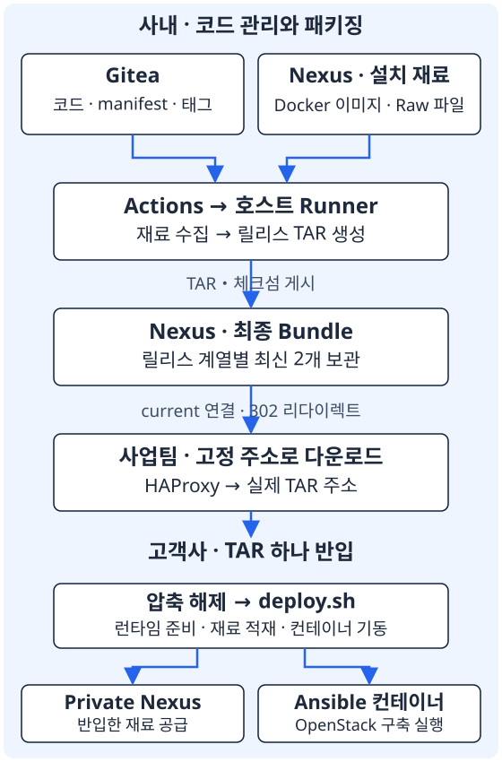

<section class="editorial-summary" aria-labelledby="editorial-summary-title">
  <div class="editorial-summary-layout">
    <div class="editorial-summary-copy">
      <span class="editorial-summary-label">왜 Git 경량화를 시작했는가</span>
      <h2 id="editorial-summary-title" class="editorial-summary-title">코드 한 줄을 바꾸려고, 교체된 이미지 이력까지 내려받을 필요는 없었다.</h2>
      <p>OpenStack 구축용 Ansible과 대용량 설치 파일을 모두 Git에 넣었다. 개발팀은 두 저장소에 변경을 반복 반영했고, 사업수행팀은 배포에 쓰지 않을 과거 파일까지 내려받았다. 코드 관리와 배포 파일 공급을 분리해 이 흐름을 바꿨다.</p>
      <table>
        <thead><tr><th>As-is · 기존</th><th>To-be · 변경</th></tr></thead>
        <tbody>
          <tr><td>Git에 코드·이미지·설치 파일 보관</td><td>Git은 코드, Nexus는 대용량 파일</td></tr>
          <tr><td>개발·배포 저장소에 반복 반영</td><td>저장소 하나와 릴리스 태그</td></tr>
          <tr><td>사업팀이 버전 브랜치를 전체 clone</td><td>필요한 릴리스 TAR 하나 다운로드</td></tr>
          <tr><td>반입 재료를 직접 준비</td><td>Runner가 수집·패키징</td></tr>
        </tbody>
      </table>
    </div>
    <aside class="editorial-summary-facts" aria-label="기존 clone 용량">
      <div><span class="editorial-fact-label">기존 clone 디렉터리</span><p class="editorial-fact-value">26.25<span>GiB</span></p></div>
      <div><span class="editorial-fact-label">그중 .git</span><p class="editorial-fact-value">19.40<span>GiB</span></p></div>
    </aside>
  </div>
  <p class="editorial-summary-result"><span>목표는 파일을 무조건 작게 만드는 것이 아니라, <strong>개발할 코드와 배포할 재료를 따로 받게 하는 것</strong>이었다.</span></p>
</section>

## 1. 기존 구성 — Git이 설치 파일 저장소까지 맡았다

사내에서는 OpenStack 기반 프라이빗 클라우드를 Ansible로 구축한다. 저장소에는 플레이북·설정뿐 아니라 Ansible 실행용 컨테이너, Ceph 이미지, containerd·nerdctl 바이너리, 사내 프로그램 압축 파일, QCOW2 가상 디스크도 들어 있었다.

코드는 두 저장소로 나눠 관리했다.

| 저장소 | 역할 | 작업 방식 |
| --- | --- | --- |
| `contrabass-engine` | 개발팀이 수정하는 저장소 | 코드·파일 변경 후 commit |
| `init-container` | 사업수행팀에 전달하는 최종 저장소 | 개발 저장소의 변경을 cherry-pick 등으로 반영 |

각 저장소에는 `v305`, `v306` 같은 버전 브랜치가 있었다. 사업수행팀은 사용할 브랜치를 골라 전체 clone한 뒤, Ansible의 `files/`에 들어 있는 설치 파일을 사용했다.

<figure class="flow" aria-label="기존 개발과 배포 흐름">
  <ol><li>개발 저장소 수정</li><li>최종 저장소에도 반영</li><li>사업팀 전체 clone</li><li>파일 복사·Ansible 배포</li></ol>
</figure>

처음에는 단순했다. Git만 받으면 코드와 설치 재료가 함께 왔다. 하지만 이미지와 프로그램 버전을 계속 교체하면서, Git이 소스 관리뿐 아니라 대용량 배포 파일의 이력 보관까지 맡게 됐다.

---

## 2. 왜 불편했는가 — 개발과 반입 모두 무거워졌다

**개발자는 코드가 필요해도 이미지를 함께 받아야 했다.** 새 작업 환경에서 저장소를 받을 때 현재 이미지뿐 아니라 과거에 교체한 파일 이력도 따라왔다. 코드 변경과 직접 관련 없는 다운로드와 디스크 사용이 작업의 시작 비용이 됐다.

**같은 변경을 두 저장소에 반영해야 했다.** 개발 저장소에 수정하고, 최종 저장소에 다시 옮겼다. 무엇을 어디까지 반영했는지 사람이 확인해야 했고, 버전 브랜치별로 필요한 변경도 골라 적용해야 했다.

**사업수행팀은 사용할 릴리스보다 더 많은 데이터를 받았다.** 고객사 설치에는 특정 버전의 재료가 필요하지만, 전달 방식은 Git 전체 clone이었다. 브랜치가 계속 수정되면 같은 브랜치 이름으로 받아도 받는 시점에 따라 코드와 파일이 달라졌다.

**최신 파일을 삭제하는 것만으로는 해결되지 않았다.** Git은 과거 커밋의 파일 내용도 보관한다. 디렉터리에서 TAR를 지워도 과거 버전이 이력에 남아 있으면 clone 용량에 계속 영향을 준다.

기존 저장소를 분석하니, 문제는 커밋 개수가 아니라 대형 파일의 누적이었다.

| 핵심 지표 | 기존 분석 결과 |
| --- | --- |
| 전체 clone 디렉터리 | 26.25GiB |
| `.git` / 현재 작업 파일 | 19.40GiB / 약 6.85GiB |
| clone 전체 소요 시간 | 19분 13.51초 |
| 10MiB 이상 파일 객체 148개의 비중 | Git pack 용량의 약 99.66% |

**현재 파일보다 과거 파일 이력이 더 큰 공간을 차지하고 있었다.** 작은 PNG가 아니라 컨테이너 TAR, 프로그램 압축 파일, VM 이미지가 핵심 원인이었다.

<details class="analysis-toggle" markdown="1">
<summary>용량 분석 상세 — 무엇이 Git을 크게 만들었는가?</summary>

Git은 파일 내용을 blob이라는 객체로 저장한다. pack은 여러 객체를 압축해 묶은 저장 파일이다.

| 구분 | 분석 결과 |
| --- | --- |
| Commit 객체 | 229개, 원본 내용 합계 약 58KiB |
| Blob 객체 | 3,631개, 원본 내용 합계 30.47GiB |
| `.tar` 이력 | 분석 당시 pack 내 기여분 약 15GiB |
| `.qcow2` 이력 | 분석 당시 pack 내 기여분 약 2.6GiB |
| 다른 브랜치만의 고유 객체 | 약 175.5MiB |

원본 내용 합계에는 서로 다른 파일 버전도 포함된다. 현재 작업 파일의 합계와는 다르며, pack에서는 압축·차이 저장으로 크기가 달라진다.

다른 브랜치를 함께 받아 커진 부분보다 선택한 브랜치가 이어받은 과거 바이너리 이력이 훨씬 컸다. 커밋 메시지나 작은 설정 파일을 정리하는 것보다, 대형 파일을 Git 밖으로 분리하는 것이 우선이었다.

[Git 객체와 packfile](https://git-scm.com/book/en/v2/Git-Internals-Packfiles)

</details>

---

## 3. 검토한 방법 — shallow clone과 LFS의 범위

먼저 `--depth=1`로 최신 커밋만 받는 shallow clone을 시험했다. 과거 이력을 받지 않는 데는 도움이 됐지만, 최신 커밋에 들어 있는 대형 파일은 여전히 함께 내려왔다. 사내 Git 저장소 자체의 이미지 누적 구조도 바뀌지 않았다.

Git LFS도 검토했다. LFS는 Git에는 작은 포인터를 남기고, 파일 본체를 별도 저장소에서 받는 방식이다. Git 객체 용량을 줄이는 데 맞는 도구지만, 우리에게는 **컨테이너 이미지 공급과 폐쇄망 반입까지 연결할 배포 구조**가 필요했다.

| 방법 | 해결하는 부분 | 우리 환경에서 남는 일 |
| --- | --- | --- |
| `--depth=1` | 클라이언트가 받는 과거 커밋 제한 | 현재 대형 파일은 그대로 수신 |
| Git LFS | 대형 파일 본체를 Git 객체와 분리 | 파일 다운로드·캐시·폐쇄망 반입 준비 |
| Nexus 분리 | 컨테이너 이미지와 일반 파일을 배포 저장소에서 공급 | Ansible 다운로드와 릴리스 패키징 연결 |

그래서 shallow clone은 **코드를 가볍게 받는 수단**으로 남기고, 설치 재료는 Nexus로 옮겼다. 단순히 Git의 저장 방식을 바꾸는 대신, 코드와 배포 파일의 역할을 나누는 방향을 선택했다.

<details class="analysis-toggle" markdown="1">
<summary>LFS를 쓰면 과거 이미지도 모두 내려받는가?</summary>

기본 LFS clone·checkout은 현재 checkout에 필요한 파일을 받는다. 동일 브랜치의 과거 커밋에 있는 모든 버전을 자동으로 받는 것은 아니다. 다만 현재 파일이 작업 디렉터리와 `.git/lfs/objects` 캐시에 각각 존재할 수 있다.

이미 Git에 쌓인 과거 대형 객체까지 포인터로 바꾸려면 별도의 이력 마이그레이션이 필요하다. LFS 도입과 기존 이력 정리는 다른 작업이다.

[LFS fetch](https://github.com/git-lfs/git-lfs/blob/main/docs/man/git-lfs-fetch.adoc), [LFS migrate](https://github.com/git-lfs/git-lfs/blob/main/docs/man/git-lfs-migrate.adoc)

</details>

---

## 4. 개선한 구조 — 코드·설치 재료·반입물을 분리했다

**Git에는 코드와 릴리스 목록을 둔다.** 대형 파일 대신 Ansible, 설치 스크립트, `manifest.yaml`을 관리한다. manifest는 해당 릴리스에 필요한 파일 경로·버전·해시와 컨테이너 이미지 목록이다.

**Nexus에는 설치 재료와 완성된 반입물을 둔다.** 컨테이너는 Registry 형식으로, 압축 파일·바이너리·VM 이미지는 일반 파일 형식으로 저장한다.

| Nexus Repository | 역할 |
| --- | --- |
| `docker-hosted` | Ansible 실행 이미지, Ceph 등 컨테이너 이미지 |
| `raw-hosted` | TAR.GZ, 런타임 바이너리, wheel, QCOW2 |
| `raw-manifest` | 릴리스별 manifest와 코드 식별 정보 |
| `raw-release-bundle` | 고객사 반입용 TAR와 체크섬 |

**Ansible도 파일을 구하는 위치를 바꿨다.** 기존에는 Git의 `files/`에서 복사했다. 변경 후에는 대상 서버가 Nexus에서 필요한 파일을 다운로드한다. 사용자는 inventory의 공통 변수에 Nexus 주소를 설정한다. 사내에서는 사내 Nexus, 고객사에서는 반입한 Private Nexus를 사용하고, Repository 내부 경로는 유지한다.

```text
기존: Git의 files/ → Ansible copy → 대상 서버
변경: Nexus의 파일 → Ansible get_url → 대상 서버
```

패키지 버전이나 경로를 바꿀 때는 패키징 목록인 `manifest.yaml`과 Ansible 참조 설정인 `nexus.yml`을 함께 맞춘다. 하나는 반입할 재료를 결정하고, 다른 하나는 배포할 때 사용할 재료를 결정하기 때문이다.

**릴리스 태그가 패키징의 시작점이 됐다.** 개발·최종 저장소에 반복 반영하던 방식은 하나의 저장소와 태그 기반 릴리스 관리로 바꿨다. 태그는 특정 커밋에 붙이는 이름으로, 사업팀에 전달할 코드와 파일 목록의 기준을 고정한다.

```text
feature/* → develop → master → v4.x.x 태그
```

일반 코드 push마다 대형 TAR를 만들지는 않는다. 배포할 코드와 이미지 목록이 확정되면 새 태그를 붙이고, Gitea Actions가 패키징을 시작한다. Runner는 명령을 실제로 실행하는 프로그램이며, 호스트 실행 방식·동시 작업 1개로 구성했다.

<figure class="flow" aria-label="태그에서 최종 배포 TAR까지">
  <ol><li>릴리스 태그 push</li><li>코드·manifest 확보</li><li>Nexus 재료 수집·TAR 생성</li><li>게시·다운로드 연결 갱신</li></ol>
</figure>

반복 작업의 비용도 줄였다.

- Raw 파일은 SHA256 캐시가 일치하면 재사용한다. SHA256은 파일 내용이 같은지 확인하는 값이다.
- 컨테이너 이미지는 containerd에 저장된 콘텐츠를 재사용한다.
- 최종 Bundle은 **릴리스 계열별 최신 2개**를 보관한다. 원본 이미지와 Git 태그를 삭제하는 정책은 아니다.
- 고정 다운로드 주소는 HAProxy가 실제 버전별 TAR로 연결한다. 같은 TAR를 주소마다 중복 저장하지 않는다.

<details class="analysis-toggle" markdown="1">
<summary>패키징 내부 동작과 다운로드 연결</summary>

Runner는 소스를 shallow clone하고, manifest를 게시한 뒤 코드·Raw 파일·이미지·설치 스크립트를 모아 TAR를 만든다. 완성된 TAR와 체크섬을 Nexus에 올리고, 게시된 릴리스에 맞춰 다운로드 주소를 갱신한다.

`release-info.yaml`은 코드 커밋과 manifest 해시, 완성된 TAR의 경로·해시를 이어 주는 식별 정보다. 같은 파일명이라도 manifest 게시 단계와 Bundle 게시 단계의 내용은 다르다.

사업팀이 고정 주소로 요청하면 HAProxy는 주소 매핑을 조회해 실제 파일로 이동하라는 302 응답을 보낸다. 다운로드 도구가 이 응답을 따라 Nexus의 버전별 TAR를 받는다.

캐시는 재다운로드를 줄인다. 코드가 바뀐 새 릴리스라면 이미지를 재사용하더라도 최종 TAR 생성과 업로드는 다시 수행한다.

[Gitea Runner](https://docs.gitea.com/runner/), [Ansible get_url](https://docs.ansible.com/projects/ansible/latest/collections/ansible/builtin/get_url_module.html)

</details>

---

## 5. 결과와 최종 아키텍처 — 사업팀은 TAR 하나를 가져간다

최종 전달물은 `contrabass-engine-deploy.tar`다. 사업수행팀은 전체 현재 릴리스 또는 필요한 계열의 현재 릴리스를 선택해 다운로드한다.

| 선택 | 고정 다운로드 경로의 형태 |
| --- | --- |
| 전체 현재 릴리스 | `current/stable/contrabass-engine-deploy.tar` |
| 4.1 계열의 현재 릴리스 | `current/4.1/contrabass-engine-deploy.tar` |

위 경로는 다운로드 진입점이다. 실제 파일은 Nexus의 릴리스별 경로에 보관하고, HAProxy가 연결한다. 4.2가 출시된 뒤에도 4.1 계열을 선택해 해당 계열의 현재 패키지를 받을 수 있다.

[{ .architecture-diagram }](../assets/git-artifact-separation/release-architecture.svg)

TAR에는 코드와 필요한 이미지·파일뿐 아니라 **Nexus 자체 이미지, containerd·nerdctl 등 초기 기동 재료와 `deploy.sh`**를 함께 넣는다. Nexus가 아직 없는 고객사에서도 설치를 시작할 수 있어야 하기 때문이다.

사업수행팀의 작업은 다음 흐름으로 정리됐다.

<figure class="flow" aria-label="사업수행팀 고객사 반입 흐름">
  <ol><li>TAR 하나 다운로드</li><li>고객사로 반입·압축 해제</li><li>deploy.sh 실행</li><li>Private Nexus·Ansible 컨테이너 기동</li></ol>
</figure>

기동된 Ansible 컨테이너에서 고객사 inventory를 설정하고 OpenStack 구축을 진행한다. `deploy.sh`는 이미 준비된 런타임과 서비스 상태를 확인해, 중간 실패 후에도 필요한 단계를 다시 실행할 수 있도록 구성했다.

| 담당 | 기존에 해야 했던 일 | 바뀐 작업 |
| --- | --- | --- |
| 개발팀 | 코드 수정에도 대형 Git 확보, 두 저장소에 반복 반영 | 코드와 파일 목록 관리, 태그로 릴리스 확정 |
| 패키징 담당 | 배포 재료를 모아 반입 준비 | Runner가 릴리스 목록 기준으로 수집·패키징 |
| 사업수행팀 | 버전 브랜치 전체 clone | 필요한 계열의 TAR 하나 다운로드·반입 |
| 고객사 설치 | Git에 포함된 파일로 배포 | Private Nexus에서 재료를 공급받아 배포 |

Git 경량화는 배포에 필요한 이미지 자체를 없애는 작업이 아니었다. **코드를 받을 때 이미지 이력을 따라 받지 않고, 배포할 때 필요한 버전의 재료만 가져가도록 전달 방식을 바꾼 작업**이었다.

<details class="analysis-toggle" markdown="1">
<summary>기존 Git 이력과 앞으로 적용할 운영 규칙</summary>

대형 파일을 Nexus로 옮겨도 기존 Git 이력은 자동으로 사라지지 않는다. 기존 저장소를 계속 쓴다면 과거 이력을 정리하는 전환 작업이 별도로 필요하다. 새 코드 저장소를 시작하는 경우에는 과거 바이너리 이력을 다시 가져오지 않도록 한다.

브랜치 보호 정책은 추가 적용할 운영 규칙이다. master 직접 push 차단과 PR·merge 중심 운영을 검토하고, develop의 직접 push 허용 범위는 팀 정책으로 정한다.

다음 자동화는 패키징 이후 설치 검증이다. TAR를 staging에 게시하고, OpenTofu로 만든 VMware VM에서 설치 시험을 통과한 뒤 정식 릴리스와 current 연결을 갱신하는 흐름을 계획하고 있다.

</details>
