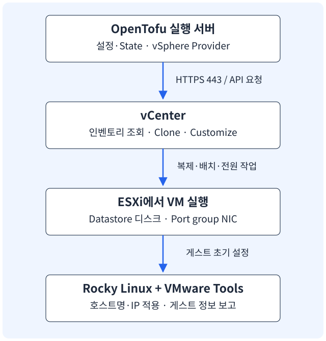

<section class="editorial-summary editorial-summary--text-only" aria-labelledby="editorial-summary-title">
  <div class="editorial-summary-layout">
    <div class="editorial-summary-copy">
      <span class="editorial-summary-label">이 가이드의 흐름</span>
      <h2 id="editorial-summary-title" class="editorial-summary-title">vCenter에 복제를 요청하고, VMware Tools로 VM 내부 설정을 마무리한다.</h2>
      <p>OpenTofu 실행 서버는 vCenter API에 연결한다. vCenter가 ESXi·datastore·네트워크를 사용해 템플릿을 복제하고, 게스트 커스터마이징이 Rocky의 호스트명과 IP를 설정한다. 접속 경로와 설정 경로를 구분해 VM 한 대부터 시작한다.</p>
    </div>
  </div>
  <p class="editorial-summary-result"><span><strong>환경 확인 → 템플릿 준비 → 코드 작성 → 생성·접속 → 추가·삭제</strong> 순서로 따라간다.</span></p>
</section>

[OpenTofu 입문 가이드 - 1](2026-10-08-opentofu-basics.md)에서 익힌 개념을 VMware VM 생성 실습으로 연결한다. 이 글은 **vCenter가 관리하는 vSphere 환경, Rocky Linux 9.6 일반 VM 템플릿, 고정 IPv4**를 기준으로 한다. vSphere Client의 메뉴 이름은 버전·언어에 따라 조금 다르다.

## 1. 어떤 서버에 무엇을 요청하는가

[](../assets/opentofu-vsphere/vcenter-flow.svg)

| 구성 요소 | 담당하는 일 | 예제에서 넣는 값 |
| --- | --- | --- |
| OpenTofu 실행 서버 | 설정을 읽고 Provider를 실행 | 관리용 Linux 서버 또는 Runner |
| vCenter | 인벤토리 조회, 복제·전원·커스터마이징 요청 처리 | `vcenter.example.com` |
| ESXi | VM의 CPU·메모리·가상 장치 실행 | Cluster에서 배치되는 호스트 |
| Datastore | VM 디스크와 설정 파일 저장 | `lab-datastore` |
| Port group | VM의 가상 NIC 연결 | `lab-management` |
| VMware Tools | 게스트 정보 보고와 초기 설정 처리 | Rocky의 `vmtoolsd` |

**접속 대상은 vCenter다.** Provider의 `vsphere_server`에는 ESXi IP나 게스트 VM IP가 아니라 vCenter의 FQDN 또는 IP를 넣는다. 템플릿 clone은 vCenter가 필요하며, 직접 ESXi 연결에서는 지원하지 않는다. [Provider 연결 설정](https://github.com/vmware/terraform-provider-vsphere/blob/v2.17.1/docs/index.md), [VM clone 조건](https://github.com/vmware/terraform-provider-vsphere/blob/v2.17.1/docs/resources/virtual_machine.md)

처리 순서는 다음과 같다.

1. Provider가 HTTPS로 vCenter에 로그인한다.
2. Datacenter·Cluster·Datastore·Port group·템플릿을 이름으로 조회해 ID를 얻는다.
3. 템플릿 UUID와 배치·사양을 포함한 복제 요청을 보낸다.
4. vCenter가 작업을 실행하고 VM을 부팅한다.
5. 게스트 커스터마이징이 VMware Tools를 통해 호스트명·IP 등을 적용한다.
6. Provider가 완료 상태와 게스트 네트워크 정보를 기다리고 State·output을 기록한다.

Provider가 가상화 관리 API를 호출하는 것과 Ansible이 SSH로 게스트에 접속하는 것은 다른 연결이다. vCenter에 접속할 수 있어도 새 VM의 네트워크에 경로가 없으면 SSH·Ansible은 실패한다.

## 2. vCenter에서 확인할 값

브라우저로 `https://vcenter.example.com/ui/`에 접속한다. 여기서 확인하는 이름을 뒤의 `lab.tfvars`에 넣는다. 예제 이름은 실제 환경의 이름으로 바꿔야 한다.

| 확인 대상 | vSphere Client에서 볼 위치 | 입력값·주의 |
| --- | --- | --- |
| vCenter 주소·버전 | 로그인 주소, vCenter의 Summary·About | FQDN 또는 IP. Provider에는 `/ui/`·`/sdk`를 넣지 않음 |
| Datacenter | Hosts and Clusters의 상위 객체 | `Lab-DC` |
| Cluster | Datacenter 아래 ESXi가 모인 객체 | `Lab-Cluster` |
| Resource Pool | Cluster·Host 아래 자원 할당 계층 | 예제는 Cluster의 기본 pool 사용 |
| Datastore | Storage → 대상 datastore | `lab-datastore`, 여유 공간 확인 |
| Port group | Networking → 대상 네트워크 | `lab-management`, VLAN·연결 가능한 ESXi 확인 |
| 원본 템플릿 | VMs and Templates → Templates 폴더 | `Templates/rocky-9.6-base-v1` |
| 생성할 폴더 | VMs and Templates → Lab 폴더 | Datacenter의 VM 루트 기준 `Lab/opentofu` |

**VM 폴더와 datastore 폴더는 다르다.** 여기서 `Lab/opentofu`는 vCenter 인벤토리의 VM 폴더다. datastore 브라우저의 파일 경로를 입력하는 곳이 아니다. 폴더는 미리 만들고 템플릿과 중복되지 않는 이름을 사용한다.

예제는 Cluster가 있는 환경이다. Datacenter 아래 ESXi 하나만 있고 Cluster가 없다면 `vsphere_compute_cluster` 조회를 그대로 사용할 수 없다. 해당 Host의 Resource Pool을 조회하는 코드로 바꿔야 한다. [Cluster data source](https://github.com/vmware/terraform-provider-vsphere/blob/v2.17.1/docs/data-sources/compute_cluster.md)

<details class="analysis-toggle" markdown="1">
<summary>vCenter 연결과 VM 연결을 따로 확인하는 방법</summary>

OpenTofu 실행 서버에서 vCenter 이름 해석과 HTTPS 연결을 확인한다.

```bash
getent hosts vcenter.example.com
curl --connect-timeout 10 -fsS \
  https://vcenter.example.com/sdk/vimServiceVersions.xml
```

`/sdk`는 vSphere Web Services API 경로다. 위 조회는 API 버전 정보를 읽는 연결 확인이며, 로그인 권한이나 VM 생성 권한을 증명하지 않는다. 브라우저 UI가 열린다는 사실만으로 Provider 인증이 확인된 것도 아니다.

내부 CA를 사용한다면 실행 서버의 신뢰 저장소에 CA 인증서를 넣는다. Rocky 계열의 예:

```bash
sudo install -m 0644 lab-root-ca.crt \
  /etc/pki/ca-trust/source/anchors/lab-root-ca.crt
sudo update-ca-trust
```

CA 파일은 환경 관리자가 제공한 인증서를 사용한다. IP로 접속하면 인증서 SAN에 해당 IP가 포함돼야 이름 검증이 통과한다. 예제의 `allow_unverified_ssl` 기본값은 `false`다. 실습에서 검증을 끄는 경우에는 `true`로 명시하지만, 이는 신뢰 문제를 해결하는 설정이 아니라 검증을 생략하는 설정이다.

VM 생성 이후의 연결은 별도로 확인한다.

```bash
ssh labuser@192.0.2.101
```

HTTPS 443은 실행 서버→vCenter, SSH 22는 실행 서버→게스트 VM의 연결이다. 템플릿 다운로드·Provider 설치에는 별도로 인터넷 또는 패키지 미러 접근이 필요하다. [vSphere API](https://developer.broadcom.com/xapis/vsphere-web-services-api/latest/), [Provider 인증·TLS 옵션](https://github.com/vmware/terraform-provider-vsphere/blob/v2.17.1/docs/index.md)

</details>

## 3. 계정과 권한 준비

vCenter API 계정과 Rocky SSH 계정을 구분한다.

| 계정 | 어디에 사용 | 필요한 작업 |
| --- | --- | --- |
| vCenter API 계정 | vSphere Provider | 객체 조회, VM 복제·설정 변경·전원·삭제 |
| `labuser` | Rocky 게스트 | SSH, 이후 Ansible 실행에 필요한 sudo |

**사용자를 만들고 Role을 정의하는 것만으로는 권한이 생기지 않는다.** Role은 허용할 작업의 목록이다. 실제 권한은 인벤토리의 특정 대상에 **사용자 + Role**을 연결해야 생긴다. 예를 들어 VM 폴더에 연결한 권한은 그 폴더의 VM을 관리하는 권한이지, 다른 계층의 datastore·네트워크를 사용하는 권한은 아니다.

<figure class="flow" aria-label="vCenter 계정과 권한 준비 순서">
  <ol>
    <li>전용 사용자 생성</li>
    <li>필요한 작업으로 Role 정의</li>
    <li>대상 자원에 사용자·Role 연결</li>
    <li>조회·복제·삭제 확인</li>
  </ol>
</figure>

아래는 **기존 템플릿 복제, CPU·메모리 변경, 고정 IP 설정, 전원 조작, VM 삭제**를 위한 구성이다. 탐색 경로는 한글 vSphere Client 기준으로 적고, 권한 체크박스는 영문 이름을 함께 사용한다. `메뉴`에 인벤토리만 보이는 화면에서는 **메뉴 → 인벤토리**로 들어간 뒤 상단의 보기 아이콘을 바꾼다. 버전에 따라 보기 전환 항목이 메뉴에 직접 표시되기도 한다.

| 권한을 연결할 대상 | 연결하는 이유 | 하위 항목으로 전파 |
| --- | --- | --- |
| 원본 템플릿과 VM을 만들 폴더 | 원본 복제, 목적지 VM 생성·관리 | 폴더는 켬. 원본 템플릿 하나에 직접 연결하면 끔 |
| 목적지 Cluster 또는 Resource Pool | VM에 CPU·메모리 자원을 배정 | Cluster의 기본 pool을 쓰면 켬 |
| 목적지 Datastore | 복제한 디스크를 저장 | 대상 datastore에 직접 연결, 끔 |
| 목적지 Port group | 가상 NIC를 네트워크에 연결 | 대상 네트워크에 직접 연결, 끔 |
| vCenter 최상위 객체 | 스토리지 정책 조회 | 통합 Role의 VM 권한이 확산되지 않도록 끔 |

연결 대상은 위의 **다섯 종류**다. 템플릿과 목적지 폴더가 분리돼 있으면 첫 번째 종류에서 두 곳에 연결한다. 이 글의 코드는 Cluster의 기본 Resource Pool을 사용하므로 **ESXi Host에 추가 관리 권한을 주는 절차는 넣지 않는다.**

!!! warning "Role을 넓게 전파하지 않는다"
    아래 구성은 필요한 권한을 Role 하나에 모은다. 이를 vCenter 최상위나 운영 Cluster에 연결하고 전파하면 VM 생성·삭제 권한도 하위 객체에 적용될 수 있다. vCenter 최상위의 전파는 끄고, Cluster 전파는 해당 실습 범위에 VM 관리 권한까지 허용해도 되는지 확인한다. 공유 운영 Cluster에서 배치 권한만 허용하려면 Role 분리가 필요하다.

<details class="analysis-toggle" markdown="1">
<summary>3-1. 전용 API 사용자 만들기 — 관리 → Single Sign-On → 사용자 및 그룹</summary>

vSphere Client에 사용자·Role·권한을 관리할 수 있는 관리자 계정으로 로그인한다.

1. **메뉴 → 관리(Administration) → Single Sign-On → 사용자 및 그룹(Users and Groups)**으로 이동한다.
2. **사용자(Users)** 탭에서 **도메인(Domain)**을 선택한다. 기본 SSO 도메인은 `vsphere.local`이며 환경에서 바꿨다면 실제 도메인을 선택한다.
3. **추가(ADD)**를 누른다.
4. 예제 사용자 이름 `svc-opentofu`와 비밀번호, 화면에서 요구하는 정보를 입력해 생성한다.
5. 사용자 목록에서 생성 결과를 확인한다. 이후 Provider에 전달할 이름은 `svc-opentofu@vsphere.local`이다.

자동화를 위해 이 사용자를 `Administrators` 그룹에 넣지는 않는다. 다음 단계에서 필요한 대상에 권한을 직접 연결한다. AD 계정을 쓸 경우에는 SSO 로컬 사용자를 새로 만드는 대신 등록된 인증 소스의 계정을 선택한다. [Broadcom: 사용자와 Role 생성 경로](https://knowledge.broadcom.com/external/article/422297/allowing-specific-user-accounts-to-manag.html)

</details>

<details class="analysis-toggle" markdown="1">
<summary>3-2. Role 만들기 — 선택할 권한과 이유</summary>

**메뉴 → 관리(Administration) → 액세스 제어(Access Control) → 역할(Roles) → 새로 만들기(NEW)**로 이동한다. 화면이 축약돼 있으면 각 범주의 **See more privileges**를 펼친다. 범주 전체를 체크하지 않고 아래 항목을 개별 선택한다.

Role 이름은 예를 들어 **`OpenTofu`**로 정하고, VM·자원 배치·스토리지 정책 조회 권한을 **이 Role 하나에 함께 넣는다**. 이미 만든 Role이 있다면 새로 만들지 않고 같은 화면에서 해당 Role을 편집한다.

| 권한 범주 | 체크할 항목 | 필요한 이유 |
| --- | --- | --- |
| Virtual machine → Provisioning | Deploy template | 기존 템플릿으로 일반 VM을 복제 |
| Virtual machine → Provisioning | Customize guest | Rocky의 호스트명·IP 등 게스트 설정 |
| Virtual machine → Edit Inventory | Create from existing | 복제한 VM을 목적지 폴더에 생성 |
| Virtual machine → Edit Inventory | Remove | `tofu destroy`로 생성 VM 삭제 |
| Virtual machine → Change Configuration | Change CPU count | 예제의 `num_cpus` 적용 |
| Virtual machine → Change Configuration | Change Memory | 예제의 `memory` 적용 |
| Virtual machine → Change Configuration | Change Settings | VM의 일반 구성 변경 |
| Virtual machine → Change Configuration | Modify device settings | 템플릿에서 이어받은 가상 장치의 설정 변경 |
| Virtual machine → Change Configuration | Change Swapfile Placement | Provider가 기본 swap 배치 정책 설정 |
| Virtual machine → Change Configuration | Extend virtual disk | 원본보다 큰 디스크를 지정할 때 필요. 뒤의 여러 VM 예제에서 사용 |
| Virtual machine → Interaction | Power on | 복제·설정 후 VM 부팅 |
| Virtual machine → Interaction | Power off | 전원 종료가 필요한 변경·삭제 |
| Resource | Assign virtual machine to resource pool | 목적지 Resource Pool에 VM 배치. Host 설정 변경 권한은 아님 |
| Datastore | Allocate space | VM 디스크를 저장할 공간 할당 |
| Network | Assign network | VM의 NIC를 선택한 Port group에 연결 |
| VM storage policies | View VM storage policies | Provider의 스토리지 정책 조회. 권한 ID는 `StorageProfile.View` |
| Virtual machine → Change Configuration | Add new disk | 새 디스크를 추가할 때만 선택. 기존 OS 디스크만 복제하면 불필요 |
| Virtual machine → Change Configuration | Add existing disk | 별도의 기존 VMDK를 연결할 때만 선택 |
| Virtual machine → Change Configuration | Add or remove device | NIC·컨트롤러 등 장치를 추가·제거할 때만 선택 |
| Virtual machine → Change Configuration | Advanced configuration | `extra_config`로 고급 구성 키를 변경할 때만 선택 |

`Deploy template`과 `Clone template`은 다르다. 이 실습은 **템플릿 → 일반 VM**이므로 `Deploy template`을 사용한다. 새 템플릿을 만드는 권한은 선택하지 않는다. [vSphere API: CloneVM_Task의 권한 조건](https://developer.broadcom.com/xapis/vsphere-web-services-api/latest/vim.VirtualMachine.html#clone)

뒤의 여러 VM 예제는 디스크 크기를 다르게 지정하므로 원본보다 큰 VM에는 `Extend virtual disk`가 필요하다. `nested_hv_enabled`와 `extra_config`는 서로 다른 설정이므로 같은 것으로 취급하지 않는다. [vSphere API: ReconfigVM_Task의 항목별 권한](https://developer.broadcom.com/xapis/vsphere-web-services-api/latest/vim.VirtualMachine.html#reconfigure)

`Change Swapfile Placement`는 Rocky 내부의 swap 파티션을 만드는 권한이 아니다. VMware가 사용하는 VM swap 파일의 배치 정책이며, 이 Provider는 기본값도 설정하므로 직접 HCL에 쓰지 않아도 권한이 필요하다. 또한 태그와 커스터마이징·전원 이벤트를 조회하므로 읽기 접근도 유지해야 한다. **태그를 읽기 위해 태그 생성·수정 권한을 일괄 선택하지는 않는다.** [Provider 2.17.1의 추가 권한 안내](https://github.com/vmware/terraform-provider-vsphere/blob/v2.17.1/docs/index.md#notes-on-required-privileges)

이 목록은 위 예제의 작업을 기준으로 한 구성이다. 템플릿의 추가 장치나 스토리지 정책에 따라 필요한 권한이 달라지면 오류에 나온 대상과 권한 ID를 보고 해당 항목만 보완한다.

</details>

<details class="analysis-toggle" markdown="1">
<summary>3-3. 사용자와 Role 연결하기 — 자원별 화면 경로와 하위 전파</summary>

**공통 연결 방법**

대상 객체 선택 → **권한(Permissions)** 탭 → **권한 추가(Add Permission, +)** → 도메인과 사용자 `svc-opentofu` 선택 → Role `OpenTofu` 선택 → **하위 항목으로 전파(Propagate to children)** 지정 → 확인 순서다. 아래 대상에는 모두 같은 Role을 연결한다. Role 정의 화면이 아니라 **권한을 적용할 대상 객체의 화면**에서 연결한다.

**① 원본 템플릿과 목적지 VM 폴더**

경로: **메뉴 → 인벤토리 → VM 및 템플릿(VMs and Templates) 보기 → vCenter → Datacenter → 대상 폴더 → 권한**.

- 목적지 `Lab/opentofu` 폴더에 `OpenTofu`를 연결하고 **하위 전파를 켠다**. 이후 그 안에 생성되는 VM이 권한을 상속한다.
- 이 글의 원본은 `Templates/rocky-9.6-base-v1`이다. `Templates` 폴더 전체가 아니라 **사용할 템플릿 하나**를 선택해 같은 Role을 연결하고 하위 전파는 끈다.
- 원본 템플릿과 새 VM을 같은 실습 폴더 안에 두면 그 폴더 한 곳에 연결해도 된다. 이 경우 뒤의 `template_path`도 실제 이동한 경로로 바꾼다. 예: `Lab/opentofu/rocky-9.6-base-v1`.

**② 목적지 Cluster 또는 Resource Pool**

경로: **메뉴 → 인벤토리 → 호스트 및 클러스터(Hosts and Clusters) 보기 → vCenter → Datacenter → 목적지 Cluster → 권한**.

- 이 글은 `Lab-Cluster`의 기본 Resource Pool을 쓰므로 Cluster에 `OpenTofu`를 연결하고 **하위 전파를 켠다**. 같은 Role의 VM 관리 권한도 그 범위에 전파될 수 있으므로 실습 Cluster를 사용한다.
- 특정 Resource Pool을 쓰는 구성이라면 Cluster를 펼쳐 그 **Resource Pool → 권한**에서 연결한다. 하위 pool도 사용할 때만 그 범위로 전파한다. 코드의 `resource_pool_id`도 그 pool로 맞춰야 한다.
- Cluster 아래 Host까지 VM 관리 Role을 따로 연결하지 않는다. 독립 Host의 기본 pool을 쓰는 구성은 Host 쪽에서 배치 권한을 연결하고, Cluster를 조회하는 코드도 바꿔야 한다. [Broadcom의 연결·전파 절차](https://knowledge.broadcom.com/external/article/409099)

**③ 목적지 Datastore**

경로: **메뉴 → 인벤토리 → 스토리지(Storage) 보기 → vCenter → Datacenter → 목적지 datastore → 권한**.

`lab-datastore` 자체에 `OpenTofu`를 연결하고 **하위 전파를 끈다**. datastore 내부의 파일 브라우저에서 폴더를 선택하는 것이 아니다. 이 대상에서 사용하는 권한은 `Allocate space`다.

**④ 목적지 Port group**

경로: **메뉴 → 인벤토리 → 네트워킹(Networking) 보기 → vCenter → Datacenter → 목적지 Port group → 권한**.

`lab-management`에 `OpenTofu`를 연결하고 **하위 전파를 끈다**. 분산 Port group이라면 해당 Distributed Switch 아래에서 실제 Port group을 선택한다. 네트워크 연결을 허용하는 절차이지 Switch·VLAN 구성을 바꾸는 권한을 주는 절차는 아니다.

**⑤ vCenter 최상위 객체**

경로: **메뉴 → 인벤토리 → 호스트 및 클러스터 보기 → 인벤토리 트리의 vCenter 이름 → 권한**.

Datacenter가 아니라 그 위의 **vCenter 객체**를 선택해 `OpenTofu`를 연결하고 **하위 전파는 끈다**. 통합 Role 전체를 하위 객체로 전파하지 않기 위한 설정이다.

Broadcom의 스토리지 정책 권한 해결 절차에는 하위 전파를 켜는 단계가 있지만, VM 생성·삭제까지 담긴 이 통합 Role을 그대로 전파하면 관리 범위가 넓어진다. 최상위에 `StorageProfile.View`가 연결됐는지 확인하고, 아래 실행 단계에서 실제 정책 조회 결과를 확인한다. 조회 오류가 남으면 전파를 무조건 켜지 말고 권한 적용 범위를 다시 확인한다. [Broadcom: StorageProfile.View의 적용 위치와 전파](https://knowledge.broadcom.com/external/article/384777)

**사용자 하나 + Role 하나 + 대상별 권한 연결** 구조다. 같은 Role을 여러 자원에 재사용하되, 하위 전파는 연결 대상마다 따로 지정한다.

</details>

<details class="analysis-toggle" markdown="1">
<summary>3-4. 연결한 권한 확인과 OpenTofu 계정 입력</summary>

각 자원의 **권한(Permissions)** 탭에서 사용자·Role·상속 여부를 확인한다. 상위 객체에서 받은 항목은 직접 연결한 항목과 구분해서 보고, 상속받은 권한을 바꾸려면 연결한 상위 객체로 이동한다.

1. 관리자 세션과 다른 브라우저 세션에서 `svc-opentofu@vsphere.local`로 로그인한다.
2. 원본 템플릿·목적지 폴더·Cluster·Datastore·Port group을 조회할 수 있는지 확인한다.
3. 뒤의 실행 절차에서 `VSPHERE_USER`에 이 계정을 입력하고, 비밀번호는 `VSPHERE_PASSWORD`로 전달한다. Rocky의 `labuser` 비밀번호와 혼동하지 않는다.
4. `tofu plan`으로 조회와 계획을 확인한 뒤, 실습 VM 한 대를 `tofu apply`로 생성한다. 마지막에는 실습 VM을 `tofu destroy`로 삭제해 생성·전원·삭제 권한까지 확인한다.

`plan`이 성공했다고 복제·전원·삭제 권한까지 확인된 것은 아니다. `NoPermission`이 발생하면 오류의 **대상 객체와 privilege ID**를 먼저 읽는다.

| 부족한 권한의 예 | 확인할 연결 위치 |
| --- | --- |
| `VirtualMachine.Provisioning.DeployTemplate` | 원본 템플릿 |
| `VirtualMachine.Inventory.CreateFromExisting` | VM을 만들 목적지 폴더 |
| `Resource.AssignVMToPool` | 실제 사용할 Resource Pool·Cluster의 전파 |
| `Datastore.AllocateSpace` | 선택한 datastore |
| `Network.Assign` | 선택한 Port group |
| `StorageProfile.View` | vCenter 최상위에 연결한 Role의 정책 조회 권한 |
| `VirtualMachine.Config.SwapPlacement` | 생성 VM에 상속되는 VM Role |

필요한 자원이 보이지 않으면 해당 객체와 탐색 경로의 조회 권한도 확인한다. 권한 오류를 해결하려고 모든 범주를 체크하거나 API 사용자를 관리자 그룹에 넣지는 않는다.

</details>

## 4. Rocky Linux 9.6 템플릿 준비

처음에는 **NIC 1개, SCSI OS 디스크 1개**로 단순한 기본 VM을 준비한다. 아래 코드는 이 구조를 가정한다. 추가 디스크·NIC·vTPM이 있는 템플릿은 장치 정의와 복제 조건을 별도로 맞춰야 한다.

<p class="subsection-title"><strong>4-1. 게스트 안에서 준비할 것</strong></p>

<div class="section-body" markdown="1">

템플릿으로 바꿀 원본 Rocky VM에서 실행한다.

```bash
cat /etc/rocky-release
sudo dnf install -y open-vm-tools perl openssh-server
sudo systemctl enable --now vmtoolsd sshd
rpm -q open-vm-tools perl
systemctl is-active vmtoolsd sshd
```

VMware Tools는 IP 정보와 게스트 상태를 보고하며 커스터마이징을 처리한다. 실행 서버에서 Rocky의 IP를 바꾸는 SSH 스크립트를 따로 보내는 방식과 구분된다. [open-vm-tools 역할](https://github.com/vmware/open-vm-tools/blob/master/README.md)

추가 준비 항목:

- `labuser`와 SSH 공개키, 필요한 sudo 정책 준비. 비밀번호·개인키를 템플릿에 공통으로 복제하지 않음.
- SSH가 사용하는 firewalld zone에서 접속 허용 여부 확인.
- OS 디스크·LVM 구성 확인. 가상 디스크 확장과 OS 파일시스템 확장은 별도 작업.
- NetworkManager 연결 프로필과 cloud-init 사용 여부 확인. IP를 바꾸는 주체를 중복 운영하지 않음.
- Nexus 이미지·대형 캐시·기존 클러스터 설정을 기본 템플릿에 넣지 않고 역할별 설치 과정에서 배치.

```bash
nmcli device status
nmcli connection show
systemctl is-active NetworkManager
rpm -q cloud-init
lsblk -f
sudo firewall-cmd --get-active-zones
```

cloud-init이 설치돼 있으면 VMware 커스터마이징과 어느 방식으로 초기화할지 먼저 정한다. 이 예제는 VMware Tools 기반의 일반 게스트 커스터마이징을 사용한다. cloud-init도 동일한 네트워크를 다시 설정하도록 남겨 두지 않는다.

</div>

<p class="subsection-title"><strong>4-2. Rocky 게스트 커스터마이징</strong></p>

<div class="section-body" markdown="1">

VM이 부팅되는 것과 게스트 커스터마이징 지원 여부는 별개다. vCenter·ESXi·VMware Tools 버전에 맞는 게스트 OS 지원 범위를 확인해야 한다.

Rocky가 커스터마이징 단계에서 미지원 배포판으로 인식되는 경우, Broadcom은 호환 배포판의 커스터마이징 방법을 지정하는 방식을 안내한다. **vCenter 8.0 U3 이상**에 제공되는 방법 중 RHEL 9 계열은 `GOSC_METHOD_8`이다. 아래 설정은 해당 조건에서 호환 방법을 명시할 때 사용하는 내용이다. [Broadcom 공식 안내](https://knowledge.broadcom.com/external/article/313164/configure-a-guest-customization-method-f.html)

원본 VM의 `/etc/vmware-tools/customization.conf`에 기존 설정을 확인하고 다음 섹션을 반영한다.

```ini title="/etc/vmware-tools/customization.conf"
[GOSC]
COMPATIBILITY=GOSC_METHOD_8
```

vCenter 8.0 U3보다 오래된 환경에 이 설정만 넣어 지원되는 것으로 간주하면 안 된다. vCenter 버전별 지원 조건을 먼저 확인한다.

템플릿 확정 전에 수동으로 한 대를 복제해 IP·호스트명 변경과 SSH 접속을 확인하면, 템플릿 문제와 OpenTofu 코드 문제를 분리하기 쉽다.

</div>

<p class="subsection-title"><strong>4-3. vCenter에서 템플릿으로 전환</strong></p>

<div class="section-body" markdown="1">

1. VM 설정에서 OS 종류·BIOS/EFI·SCSI Controller·NIC를 확인한다. 학습 예제는 vTPM 없는 기본 VM을 사용한다.
2. vSphere Client Summary에서 VMware Tools 실행 상태와 게스트 IP를 확인한다.
3. 복제 시 서로 달라야 할 machine-id·SSH 호스트키 등의 초기화 방식을 준비한다. 공통 사용자 공개키와 SSH 호스트키는 다르다.
4. ISO 연결과 불필요한 파일을 정리하고 원본 VM을 정상 종료한다.
5. VM 우클릭 → **Template → Convert to Template**으로 전환한다.
6. VMs and Templates에서 `Templates/rocky-9.6-base-v1` 같은 경로로 보관한다.

machine-id와 SSH 호스트키를 지우기만 하고 복제 후 재생성을 준비하지 않으면 서비스가 정상 기동하지 않을 수 있다. 자동 재생성·초기화는 사용하는 OS 이미지 절차에 맞추고, 복제본 간 값이 달라지는지 확인한다.

템플릿은 덮어쓰기보다 `base-v1`, `base-v2`처럼 변경 내용을 구분해 관리하면 복제 기준을 추적하기 쉽다.

</div>

## 5. 프로젝트 파일 작성

OpenTofu 실행 서버에서 실습 디렉터리를 만든다.

```bash
mkdir -p ~/opentofu-learning/vmware-lab
cd ~/opentofu-learning/vmware-lab
```

아래 여섯 파일을 같은 디렉터리에 작성한다. 예제는 vSphere Provider **2.17.1**로 고정한다. 이 버전의 공식 문서는 vSphere 8.x·9.x 지원을 안내한다. 기존 vCenter가 그보다 오래됐다면 해당 환경을 지원하는 Provider 문서를 기준으로 버전을 선택한다. [Provider 릴리스](https://github.com/vmware/terraform-provider-vsphere/releases/tag/v2.17.1)

**versions.tf — 실행 파일과 Provider의 버전**

```hcl title="versions.tf"
terraform {
  required_version = ">= 1.10.0, < 2.0.0"

  required_providers {
    vsphere = {
      source  = "vmware/vsphere"
      version = "= 2.17.1"
    }
  }
}
```

**providers.tf — 접속할 vCenter**

계정과 비밀번호는 뒤에서 `VSPHERE_USER`, `VSPHERE_PASSWORD` 환경변수로 전달한다. HCL 파일에 비밀번호를 넣지 않는다.

```hcl title="providers.tf"
provider "vsphere" {
  vsphere_server       = var.vcenter_server
  allow_unverified_ssl = var.allow_unverified_ssl
}
```

**variables.tf — 사용할 입력값**

VM 목록은 이름을 key로 갖는 map이다. VM을 몇 대 만들지는 이 목록의 항목 수로 결정한다.

```hcl title="variables.tf"
variable "vcenter_server" {
  type = string
}

variable "allow_unverified_ssl" {
  type    = bool
  default = false
}

variable "datacenter_name" {
  type = string
}

variable "cluster_name" {
  type = string
}

variable "datastore_name" {
  type = string
}

variable "network_name" {
  type = string
}

variable "template_path" {
  type = string
}

variable "vm_folder" {
  type = string
}

variable "domain" {
  type = string
}

variable "ipv4_gateway" {
  type = string
}

variable "dns_servers" {
  type = list(string)
}

variable "vms" {
  type = map(object({
    cpus         = number
    memory_mb    = number
    disk_gib     = number
    ipv4_address = string
    ipv4_prefix  = number
    nested_hv    = optional(bool, false)
  }))

  validation {
    condition = (
      length(var.vms) > 0 &&
      length(distinct([for vm in values(var.vms) : vm.ipv4_address])) == length(var.vms)
    )
    error_message = "VM 목록은 비어 있으면 안 되며 IP는 중복할 수 없다."
  }
}
```

**main.tf — 기존 인벤토리 조회와 VM 생성**

`data` 블록은 기존 객체를 읽는다. `resource` 블록만 새 VM을 관리한다.

```hcl title="main.tf"
data "vsphere_datacenter" "dc" {
  name = var.datacenter_name
}

data "vsphere_compute_cluster" "cluster" {
  name          = var.cluster_name
  datacenter_id = data.vsphere_datacenter.dc.id
}

data "vsphere_datastore" "storage" {
  name          = var.datastore_name
  datacenter_id = data.vsphere_datacenter.dc.id
}

data "vsphere_network" "management" {
  name          = var.network_name
  datacenter_id = data.vsphere_datacenter.dc.id
}

data "vsphere_virtual_machine" "template" {
  name          = var.template_path
  datacenter_id = data.vsphere_datacenter.dc.id
}

resource "vsphere_virtual_machine" "vm" {
  for_each = var.vms

  name             = each.key
  folder           = var.vm_folder
  resource_pool_id = data.vsphere_compute_cluster.cluster.resource_pool_id
  datastore_id     = data.vsphere_datastore.storage.id

  num_cpus          = each.value.cpus
  memory            = each.value.memory_mb
  guest_id          = data.vsphere_virtual_machine.template.guest_id
  firmware          = data.vsphere_virtual_machine.template.firmware
  scsi_type         = data.vsphere_virtual_machine.template.scsi_type
  nested_hv_enabled = each.value.nested_hv

  network_interface {
    network_id   = data.vsphere_network.management.id
    adapter_type = data.vsphere_virtual_machine.template.network_interface_types[0]
  }

  disk {
    label            = "disk0"
    size             = each.value.disk_gib
    thin_provisioned = data.vsphere_virtual_machine.template.disks[0].thin_provisioned
    eagerly_scrub    = data.vsphere_virtual_machine.template.disks[0].eagerly_scrub
  }

  clone {
    template_uuid = data.vsphere_virtual_machine.template.id
    linked_clone  = false
    timeout       = 30

    customize {
      timeout = 15

      linux_options {
        host_name = each.key
        domain    = var.domain
      }

      network_interface {
        ipv4_address = each.value.ipv4_address
        ipv4_netmask = each.value.ipv4_prefix
      }

      ipv4_gateway    = var.ipv4_gateway
      dns_server_list = var.dns_servers
    }
  }

  wait_for_guest_net_timeout = 10

  lifecycle {
    precondition {
      condition     = each.value.disk_gib >= data.vsphere_virtual_machine.template.disks[0].size
      error_message = "VM 디스크는 원본 템플릿 디스크보다 작게 만들 수 없다."
    }
  }
}
```

학습 예제에서 중요한 연결은 다음과 같다.

- `template.id`는 템플릿 UUID다. 이름으로 조회해 얻은 값을 clone에 전달한다.
- `cluster.resource_pool_id`로 VM이 사용할 자원 pool을 선택한다.
- VM 바깥 `network_interface`는 **가상 NIC를 Port group에 연결**한다.
- `customize` 안의 `network_interface`는 **Rocky 내부 IP를 설정**한다. 여러 NIC를 쓰면 선언 순서를 맞춰야 한다.
- `firmware`, `guest_id`, `scsi_type`는 템플릿 값을 따른다. EFI 템플릿을 BIOS로 만드는 실수를 피한다.
- `linked_clone = false`는 Full Clone이다. 복제 후 디스크가 원본 snapshot에 의존하지 않도록 시작한다.
- clone·customization·guest network timeout은 서로 다른 대기 단계이며 단위는 분이다.

조회할 템플릿 속성은 [VM data source](https://github.com/vmware/terraform-provider-vsphere/blob/v2.17.1/docs/data-sources/virtual_machine.md), 복제와 커스터마이징 옵션은 [VM resource](https://github.com/vmware/terraform-provider-vsphere/blob/v2.17.1/docs/resources/virtual_machine.md)를 참고한다.

**outputs.tf — 다음 단계에서 사용할 정보**

```hcl title="outputs.tf"
output "vm_info" {
  value = {
    for name, vm in vsphere_virtual_machine.vm : name => {
      id            = vm.id
      configured_ip = var.vms[name].ipv4_address
      reported_ip   = vm.default_ip_address
    }
  }
}
```

`configured_ip`는 입력한 값이고 `reported_ip`는 게스트에서 보고된 값이다. 입력값이 출력됐다는 이유만으로 실제 네트워크 설정이 성공했다고 판단하지 않는다.

**lab.tfvars — 먼저 VM 한 대**

예제의 이름·문서용 IP를 실제 테스트 환경의 값으로 바꾼다. prefix는 `24`처럼 넣는다. `255.255.255.0` 문자열을 넣는 자리가 아니다.

```hcl title="lab.tfvars"
vcenter_server = "vcenter.example.com"

datacenter_name = "Lab-DC"
cluster_name    = "Lab-Cluster"
datastore_name  = "lab-datastore"
network_name    = "lab-management"
template_path   = "Templates/rocky-9.6-base-v1"
vm_folder       = "Lab/opentofu"

domain       = "lab.example.com"
ipv4_gateway = "192.0.2.1"
dns_servers  = ["192.0.2.53"]

vms = {
  deploy-01 = {
    cpus         = 2
    memory_mb    = 4096
    disk_gib     = 40
    ipv4_address = "192.0.2.101"
    ipv4_prefix  = 24
  }
}
```

40GiB 디스크는 템플릿의 원본 디스크가 40GiB 이하일 때 사용할 예다. Nexus·OpenStack 검증에 필요한 디스크와 메모리는 별도로 산정한다.

## 6. 인증과 조회부터 시작

실습 디렉터리에서 계정과 비밀번호를 입력받는다. 입력값을 명령줄에 직접 적어 셸 이력에 남기는 방식은 피한다.

```bash
read -r -p 'vCenter 계정: ' VSPHERE_USER
read -r -s -p 'vCenter 비밀번호: ' VSPHERE_PASSWORD
printf '\n'
export VSPHERE_USER VSPHERE_PASSWORD
```

Provider는 이 환경변수 이름을 지원한다. 새 터미널에서는 다시 전달해야 한다. VM에 접속할 SSH 계정은 여기 넣지 않는다.

```bash
tofu init
tofu fmt
tofu validate
tofu plan -var-file=lab.tfvars -out=create.tfplan
tofu show create.tfplan
```

`init`에서 vSphere Provider와 `.terraform.lock.hcl`이 준비된다. `plan`에서는 실제 vCenter 인증과 data source 조회가 진행된다. 템플릿을 찾지 못하거나 권한이 부족하면 이 단계에서 원인을 확인한다.

plan에서는 VM 1대의 생성, 이름, 폴더, datastore, CPU·메모리·디스크, IP를 확인한다. UUID처럼 실행 뒤 정해질 값은 `known after apply`로 표시될 수 있다.

!!! warning "저장한 계획을 적용하면 추가 질문 없이 실행"
    create.tfplan을 읽고 실습 VM만 생성되는지 확인한 뒤 다음 명령을 실행한다. 기존 VM 삭제·교체가 포함돼 있으면 대상과 원인을 먼저 확인한다.

```bash
tofu apply create.tfplan
tofu output vm_info
tofu state list
```

vSphere Client의 **Recent Tasks**에서 Clone virtual machine, Reconfigure, Power on, Customization 관련 작업을 확인한다. 게스트에 들어가 설정 결과를 확인한다.

```bash
ssh labuser@192.0.2.101
hostnamectl
ip -br address
ip route
systemctl is-active vmtoolsd
```

Provider의 완료 대기는 SSH 서버·Nexus·OpenStack 서비스의 준비 완료까지 보장하지 않는다. 다음 설치 단계에서는 해당 서비스의 준비 여부를 따로 확인한다.

## 7. 여러 VM과 역할별 사양

VM 한 대가 정상 복제된 뒤 `lab.tfvars`의 `vms`에 항목을 추가한다. 아래는 기존 deploy를 유지하고 controller와 compute를 추가하는 예시다.

```hcl title="lab.tfvars — vms 부분 교체"
vms = {
  deploy-01 = {
    cpus         = 2
    memory_mb    = 4096
    disk_gib     = 40
    ipv4_address = "192.0.2.101"
    ipv4_prefix  = 24
  }
  controller-01 = {
    cpus         = 4
    memory_mb    = 8192
    disk_gib     = 60
    ipv4_address = "192.0.2.102"
    ipv4_prefix  = 24
  }
  compute-01 = {
    cpus         = 4
    memory_mb    = 8192
    disk_gib     = 80
    ipv4_address = "192.0.2.103"
    ipv4_prefix  = 24
    nested_hv    = true
  }
}
```

これは役割별 입력을 설명하는 사양이다. OpenStack 전체 기능을 시험할 때는 NIC·디스크·메모리 요구사항을 해당 Ansible 구성에 맞춰 늘린다.

```bash
tofu plan -var-file=lab.tfvars -out=expand.tfplan
tofu show expand.tfplan
tofu apply expand.tfplan
```

`for_each`는 이름을 식별 key로 쓴다. `compute-02`를 추가하면 그 항목이 생성 대상이 된다. 기존 key를 삭제하면 해당 VM은 삭제 대상이고, key를 바꾸면 기존 객체 삭제와 새 객체 생성으로 해석될 수 있다. 단순 이름 변경과 코드 식별자 변경을 혼동하지 않는다. [for_each](https://opentofu.org/docs/language/meta-arguments/for_each/)

Compute VM 안에서 다시 KVM 인스턴스를 실행하려면 중첩 가상화가 필요하다. `nested_hv_enabled`는 가상화 기능을 게스트에 노출하는 설정이며, 물리 CPU·ESXi·VM 구성도 이를 지원해야 한다. 게스트에서 확인한다.

```bash
lscpu | grep -E 'Virtualization|Hypervisor'
grep -Eo 'vmx|svm' /proc/cpuinfo | sort -u
```

CPU 플래그가 보이는 것과 실제 OpenStack 인스턴스 실행 성공은 다르다. KVM 모듈과 Nova 설정까지 이어서 확인한다.

**동시 생성과 IP 할당**

독립적인 리소스는 병렬 실행될 수 있다. 작은 실습 환경에서 복제 부하를 제한하려면 `tofu apply -parallelism=2 expand.tfplan`처럼 실행한다. Runner 동시 작업 1개와 OpenTofu 내부 병렬도는 별개다. [apply 옵션](https://opentofu.org/docs/cli/commands/apply/)

OpenTofu가 IP를 지정한다고 DHCP·IPAM에서 그 IP를 예약해 주지는 않는다. 실제 네트워크에서 예약한 미사용 IP를 넣어야 한다.

<details class="analysis-toggle" markdown="1">
<summary>고정 IP 대신 DHCP를 쓰려면?</summary>

`clone.customize`의 NIC 블록을 비우고 `ipv4_gateway`를 제거한다.

```hcl title="DHCP용 customize NIC 부분"
network_interface {}
```

바깥의 Port group 연결 블록은 유지한다. IP가 정해지는 주체만 DHCP로 바뀌는 것이다. 변수에서 고정 IP를 제거하면 `vms` 타입·중복 IP 검증·`configured_ip` output도 함께 변경해야 한다. 뒤의 Ansible에는 VMware Tools에서 보고한 주소나 별도 DHCP 조회 결과를 전달한다.

DHCP 서버가 없는 네트워크에서는 이 방식만으로 주소가 생기지 않는다. [커스터마이징 네트워크 옵션](https://github.com/vmware/terraform-provider-vsphere/blob/v2.17.1/docs/resources/virtual_machine.md#network-interface-settings)

</details>

## 8. 변경·실패·삭제

**같은 설정을 다시 실행**

```bash
tofu plan -var-file=lab.tfvars
```

변경이 없다면 계획에도 추가 작업이 없어야 한다. CPU·메모리·디스크·커스터마이징 값을 바꿨을 때는 재구성인지 VM 교체인지 확인한다. 가상 디스크를 늘려도 Rocky의 partition·LVM·파일시스템 확장은 따로 필요할 수 있다.

**중간에 실패**

실행 실패가 “VM이 하나도 만들어지지 않았다”는 뜻은 아니다. State와 vCenter Recent Tasks를 함께 확인한다.

```bash
tofu state list
tofu plan -var-file=lab.tfvars
```

State에 VM이 연결돼 있으면 오류를 해결하고 새 계획으로 진행한다. vCenter에만 남은 객체는 기존 State 복구·import·실습 VM 정리 중 적절한 방법을 선택한다. 이름이 겹친다고 무작정 State 파일을 지우고 다시 만들지 않는다.

**실습 VM 삭제**

아래 계획은 **현재 State가 관리하는 VM**을 삭제한다. source 템플릿과 data source로 조회한 Cluster·Datastore·Port group은 삭제 대상이 아니다. 삭제된 게스트의 디스크와 데이터는 백업이 없으면 복구할 수 없다.

```bash
tofu state list
tofu plan -destroy -var-file=lab.tfvars -out=destroy.tfplan
tofu show destroy.tfplan
```

지워질 VM을 확인한 뒤 적용한다.

```bash
tofu apply destroy.tfplan
tofu state list
unset VSPHERE_USER VSPHERE_PASSWORD
```

계정·환경값·State는 삭제에도 필요하다. 생성 직후 작업 디렉터리와 State를 지우면 나중에 자동 정리가 어려워진다. [OpenTofu destroy](https://opentofu.org/docs/cli/commands/destroy/)

## 9. 자주 막히는 지점

| 증상 | 먼저 구분할 것 | 확인 위치 |
| --- | --- | --- |
| x509 인증서 오류 | CA 신뢰·SAN·접속 주소 | 실행 서버의 curl, Provider TLS 설정 |
| 로그인 실패 | vCenter API 계정과 SSO 도메인 | 같은 계정의 vSphere Client 로그인 |
| Datacenter·Cluster 조회 실패 | 실제 이름·조회 권한 | Hosts and Clusters |
| 템플릿을 찾지 못함 | Datacenter 기준 상대 폴더·이름 | VMs and Templates |
| Permission denied | 원본·목적지·네트워크·스토리지 권한 | 오류 privilege, 각 객체 Permissions |
| 복제는 됐지만 OS 부팅 실패 | EFI/BIOS·컨트롤러·디스크 | VM 콘솔, 템플릿 설정 |
| Customization timeout | Rocky 지원 조건·Tools·Perl·네트워크 초기화 충돌 | vCenter Events, 게스트 Tools 로그 |
| Guest network timeout | 실제 IP·게이트웨이·Tools 보고 | VM 콘솔, Summary, nmcli |
| 디스크 크기 오류 | 원본보다 작은 디스크 또는 다른 장치 구조 | 템플릿 Edit Settings |
| SSH 접속 실패 | 라우팅·방화벽·sshd·계정 공개키 | VM 콘솔과 SSH 상세 로그 |

Rocky 콘솔에서 확인할 명령:

```bash
systemctl status vmtoolsd --no-pager
journalctl -u vmtoolsd -b --no-pager
sudo ls -l /var/log/vmware-imc/
nmcli device status
nmcli connection show
ip -br address
ip route
systemctl status sshd --no-pager
```

`/var/log/vmware-imc/`에는 게스트 커스터마이징 관련 로그가 생성될 수 있다. 해당 디렉터리나 로그가 없는 경우에는 커스터마이징이 시작됐는지부터 vCenter Events와 Tools 상태를 확인한다.

IP 대기 timeout만 늘려서 해결하려고 하지 않는다. NIC 연결 문제, 잘못된 VLAN, 미지원 커스터마이징은 기다리는 시간을 늘려도 바뀌지 않는다.

## 10. Ansible·릴리스 검증으로 연결

VM 생성 이후 결과를 JSON으로 내보내면 다음 단계가 읽기 쉽다.

```bash
tofu output -json vm_info > vm-info.json
```

다음 단계는 이름별 VM IP를 Ansible inventory의 Deploy·Controller·Compute 그룹으로 연결한다. VMware Tools가 보고한 IP와 실제 SSH 연결을 확인한 뒤 설치를 시작한다.

<figure class="flow" aria-label="VM 생성 이후 배포 검증으로 이어지는 흐름">
  <ol><li>OpenTofu VM 생성</li><li>IP·SSH 준비 확인</li><li>Ansible 설치·기능 시험</li><li>로그 수집·VM 삭제</li></ol>
</figure>

릴리스 검증에서는 실행마다 VM 이름·폴더·State를 분리한다. 생성된 Deploy VM이 staging Bundle을 다운로드하고, Private Nexus와 Ansible 컨테이너를 준비한 뒤 나머지 노드를 설치하는 흐름으로 확장할 수 있다.

여기서 OpenTofu가 판단하는 VM 생성 성공과 Ansible의 설치 성공, OpenStack 기능 시험 성공은 각각 다른 결과다. Workflow는 단계별 결과를 받아 다음 단계로 진행하고, 실패해도 해당 실행에서 만든 VM을 정리할 수 있게 State를 유지한다.

## 11. 참고 자료

- [OpenTofu 입문 가이드 - 1](2026-10-08-opentofu-basics.md)
- [VMware vSphere Provider 2.17.1](https://github.com/vmware/terraform-provider-vsphere/tree/v2.17.1)
- [Provider 인증·권한·지원 환경](https://github.com/vmware/terraform-provider-vsphere/blob/v2.17.1/docs/index.md)
- [VM 템플릿 조회](https://github.com/vmware/terraform-provider-vsphere/blob/v2.17.1/docs/data-sources/virtual_machine.md)
- [VM 생성·clone·커스터마이징](https://github.com/vmware/terraform-provider-vsphere/blob/v2.17.1/docs/resources/virtual_machine.md)
- [Rocky 등 호환 배포판 커스터마이징 방법](https://knowledge.broadcom.com/external/article/313164/configure-a-guest-customization-method-f.html)
- [VMware open-vm-tools](https://github.com/vmware/open-vm-tools)
