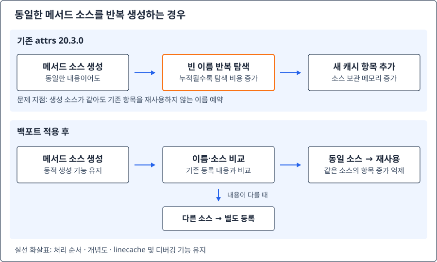

## 증상과 영향

조사 시작점은 사내 대시보드의 주기적인 하이퍼바이저 조회. Nova의 `/os-hypervisors/detail`을 호출하는 로직에서 응답 지연 발생, `nova-api.log`에서도 약 10초의 처리시간 확인.

개별 호출로 범위를 좁히던 중 특정 Controller의 Keystone 토큰 발급까지 느려지는 현상 발견. 이하 정상 노드는 Controller A/B, 문제 노드는 Controller C로 익명화.

| 확인 항목 | 정상 노드 | Controller C |
| --- | --- | --- |
| Keystone 토큰 발급 | 약 0.3초 | 약 2.3~2.4초 |
| 하이퍼바이저 조회 CLI | 정상 노드보다 C의 지연 두드러짐 | 약 6~7초 |
| Keystone `GET /v3` | 빠른 응답 | 빠른 응답 |
| API worker CPU | 대체로 낮은 사용률 | 일부 worker에서 약 100~200% 관찰 |
| worker RSS | 약 200,000 KiB | 약 1,700,000 KiB |

위 수치는 운영 환경에서 확인한 개별 관측값. 대시보드 API 로그의 약 10초와 CLI의 6~7초는 서로 다른 측정이므로 같은 요청의 전후 비교가 아님. CLI 시간에는 인증·API 호출·클라이언트 처리 등이 포함될 수 있음.

HAProxy를 우회해 Controller C의 Keystone `:5000`에 직접 접근해도 토큰 발급 지연 지속. 단순히 대시보드 화면이나 로드밸런서만의 문제로 보기 어려운 상황.

## 환경·버전

| 구분 | 실제 장애 환경 | 코드 분석·패치 테스트 환경 |
| --- | --- | --- |
| OS | RHEL 9.4 | Rocky Linux 9.6 |
| OpenStack | Caracal | Nova Epoxy 31.0.0 포함 테스트 환경 |
| Python | Python 3.9 계열 | Python 3.9.21 |
| attrs RPM | `python3-attrs-20.3.0-7.el9.noarch` | 동일 RPM |
| jsonschema | 운영 버전은 이 기록에서 명시하지 않음 | 4.16.0 |
| 분석 대상 | Keystone·Nova·Cinder API 프로세스 | Nova 요청 경로, Keystone Validator, attrs 백포트 |

같은 RPM을 사용하더라도 운영과 테스트 환경은 서로 다름. 테스트 서버의 결과를 운영 패치 적용 결과로 대체하지 않음.

## 핵심 결론과 확인 수준

핵심 원인은 **동일한 이름의 동적 클래스를 반복 생성할 때, 구버전 attrs가 생성 소스를 `linecache.cache`에 계속 추가하는 구현**.

새 가상 파일명을 확보할 때 이미 사용된 번호를 처음부터 탐색하므로, 소스 보관 메모리뿐 아니라 다음 코드 생성에 필요한 CPU 비용도 함께 증가. 운영에서 관찰한 사용자 영역 CPU 포화, 메모리 증가, Python 함수 추적 결과와 일치.

수정 방향은 동일한 이름과 동일한 생성 소스의 캐시 항목 재사용. 테스트에서는 Keystone `SchemaValidator` 10회 생성 시 관련 항목이 원본 **2→20개**, 패치본 **2개 유지**로 변경.

| 근거 수준 | 확인 내용 |
| --- | --- |
| 운영 관찰 | 노드별 지연 차이, CPU·메모리 차이, 생성 파일명 번호 증가 |
| 보존된 테스트 기록 | Nova 정적 호출 경로·실제 요청 추적, 클래스 생성과 캐시 증가, 수동 패치 검증 |
| 공식 소스·이슈 | attrs 결함과 upstream 수정, Ubuntu의 Nova 유사 사례 |
| 별도 측정 필요 | 운영 패치 적용 후 동일 조건의 응답시간·CPU·RSS 전후 비교 |

패치의 목적은 API 성능 저하 원인 제거. 다만 이 글에 보존된 패치 검증 수치는 캐시 증가 억제와 제한된 기능 확인까지이며, 운영 응답시간 개선 수치를 임의로 추가하지 않음.

## 원인 분석 및 판단 근거

### 1. Microversion 차이부터 확인

초기에는 Nova microversion `2.87`과 `2.88`의 하이퍼바이저 상세 조회 차이를 의심. 테스트 환경에서는 버전에 따른 지연 차이가 있었지만, 운영 대시보드는 `2.87`을 사용했고 운영 비교에서도 차이가 뚜렷하지 않았음.

따라서 `2.88`의 uptime 관련 추가 처리만으로 이번 문제를 설명하기 어려워 공통 처리 경로로 조사 방향 전환. API 버전 비교는 원인 후보를 줄이기 위한 단계이며 이번 해결책은 아님.

### 2. Keystone 직접 호출로 지연 위치 분리

`OS_AUTH_URL`을 Controller별로 지정해 토큰 발급 비교. Controller C를 바라볼 때만 약 2초 이상의 지연 발생, 해당 노드의 `:5000` 직접 호출에서도 같은 현상.

Keystone의 빠른 `GET /v3`는 서비스 접근과 discovery 응답 확인용. 토큰 발급 `POST /v3/auth/tokens`와 동일한 업무 처리를 수행하는 요청은 아님. GET이 빠르다는 사실만으로 POST 내부의 인증·검증 경로가 정상이라고 판단할 수 없는 이유.

노드별 설정·패키지·Fernet key는 대체로 동일. LDAP은 미사용, 모든 Controller는 동일한 DB 대상에 접근. DB 대상이 같아도 노드별 연결 경로 차이는 가능하므로 이 정보만으로 DB·네트워크를 배제하지 않음.

### 3. 요청량보다 worker 내부 상태 확인

Keystone `:5000` 트래픽 확인에 사용한 조회 명령:

```bash
tcpdump -i any -nn -tttt 'tcp port 5000'
```

노드별 통신 규모는 대체로 유사했지만 Controller C만 CPU 사용량 증가. 패킷 수가 같다고 HTTP 요청 수와 처리 비용까지 같다는 뜻은 아니며, 특정 노드에만 압도적인 트래픽이 몰렸다는 설명의 근거가 약해진 정도.

요청이 적은 상황에서도 높은 CPU 사용률 관찰. 다만 실제로 POST는 계속 유입되고 있었으므로 완전한 무요청 상태로 표현하지 않음.

6개 worker의 PID는 그대로 유지됐지만 CPU가 높은 worker는 서로 교대. 프로세스가 계속 새로 생기는 현상이 아니라, 기존 worker 사이에서 높은 처리 비용이 이동하는 상황.

스레드별 CPU 확인 명령. `P`에는 해당 시점의 worker PID 지정:

```bash
pidstat -t -u -p "$P" 1
```

CPU affinity와 cgroup CPU 제한에서는 특이사항을 찾지 못했고, 문제 프로세스의 CPU 사용은 주로 `%usr`에서 발생. 커널 처리나 네트워크 대기보다 사용자 영역 연산을 추적할 필요 증가.

### 4. strace에서 장시간 I/O 대기를 찾지 못함

DB·Memcached 연결 지연과 socket timeout을 의심해 네트워크·대기 계열 syscall 추적. 관찰한 범위에서는 비정상적으로 긴 응답 대기를 찾지 못함.

네트워크 syscall과 각 호출의 소요시간을 확인한 명령. `P`에는 관찰 대상 worker PID 지정. 수집 파일에 통신 내용이 포함될 수 있으므로 원본을 공개하지 않고 분석 후 민감정보 점검 필요.

```bash
timeout -s INT 10 strace -f -ttT -yy -p "$P" \
  -e trace=%network,poll,ppoll,select,pselect6 \
  -o /tmp/keystone-network.strace
```

epoll·accept 계열 요약에 사용한 명령. `HOT_PID`에는 현재 관찰 대상 PID 지정:

```bash
timeout -s INT 10 strace -f -c \
  -e trace=epoll_wait,epoll_pwait,epoll_ctl,accept,accept4 \
  -p "$HOT_PID"
```

중요한 해석은 `epoll_wait` 앞의 비율. 선택한 syscall의 집계 시간 비중일 뿐 프로세스 CPU 사용률이 아님. 비율이 100%에 가깝다는 이유만으로 epoll busy-spin이나 2초 timeout을 확정할 수 없음.

strace는 syscall 관찰 도구. Python 내부의 반복 문자열 생성·딕셔너리 조회는 긴 syscall 없이도 CPU를 사용할 수 있음. 이번에는 “strace에 대기가 안 보이는데 `%usr`는 높음”이라는 조합이 Python 내부 연산을 조사하는 계기.

비밀번호 해시 처리도 후보였지만 별도 bcrypt 검증 시험에서 노드 간 뚜렷한 차이를 찾지 못함. 관찰 결과만으로 모든 I/O 문제를 완전히 배제한 것은 아님.

### 5. perf로 Python 실행 경로 확인

DSO 기준 perf 결과에서 정상 노드는 `_bcrypt.abi3.so`가 두드러졌지만, Controller C에서는 libpython 실행 샘플이 두드러짐. 라이브러리 이름만으로 Python 함수 수준 원인을 확정할 수는 없어 추가 추적 진행.

Python USDT 함수 이벤트를 이용한 추적에서 다음 위치 확인:

- `attr/_make.py`: `_generate_unique_filename()`
- `uuid.py`: `__str__()`
- `<attrs generated init jsonschema.validators.create.<locals>.Validator-N>` 형태의 생성 소스

USDT 함수 진입 이벤트는 CPU 프로파일과 별개의 증거. 함수 호출 경로와 반복 실행 확인에 사용하며 이벤트 수 자체를 CPU 점유시간으로 해석하지 않음. 함수 진입 추적은 이벤트가 많아 성능 영향을 줄 수 있으므로 짧은 구간 수집과 종료 후 임시 probe 제거가 필요.

### 6. 메모리와 가상 파일명 번호를 함께 비교

| 프로세스 지표 | 정상 노드 | Controller C |
| --- | --- | --- |
| VSZ | 약 400,000 KiB | 약 1,910,000 KiB |
| RSS | 약 200,000 KiB | 약 1,700,000 KiB |
| 생성 파일명 suffix | 약 2만 수준 | 약 69만 수준 |

Controller C에서 `RssAnon`, `Anonymous`, `Private_Dirty`, `VmData`도 크게 증가. 공유 라이브러리 매핑만 늘어난 상황보다 프로세스의 익명·사유 메모리 증가를 뒷받침하는 결과.

`Validator-N`의 N은 가상 파일명의 번호. **살아 있는 Validator 객체 수, 직접 센 linecache 개수, HTTP 요청 수, 전체 worker 합계가 아님**. 각 worker는 독립적인 프로세스 캐시를 보유하므로 관찰 PID/TID와 연결해 해석.

큰 suffix와 메모리 증가에 더해 실제 이름 생성 함수의 반복 실행 및 코드 구현을 함께 확인한 것이 핵심. 메모리 수치 또는 suffix 하나만으로 원인을 확정한 것은 아님.

### 7. 테스트 서버에서 정적 코드와 실제 요청 연결

보존된 Nova 분석 기록에서는 `/servers/detail`의 query schema 검증 경로 확인. 요청 처리 중 `_SchemaValidator` 생성 → `jsonschema.validators.extend()` → `create()` → attrs 코드 생성으로 연결.

독립 Python 프로세스에서 Validator 생성 클래스의 객체 ID가 서로 다르고 관련 캐시가 증가하는 결과도 확인. 실제 요청을 처리하는 worker의 짧은 USDT 추적에서 검증 함수·이름 생성 함수·generated Validator 실행을 연결.

해당 테스트 기록의 관측값:

- Nova API 로그 응답시간: 약 2.09~2.63초.
- API worker RSS: 약 928MB~1.14GB, 비교 worker 약 128MB.
- worker CPU: 주로 `%usr` 70~100%.
- generated Validator suffix: 약 37만 수준.

이는 테스트 서버의 Nova 경로에서 확보한 별도 결과. 운영 환경의 `/os-hypervisors/detail`과 같은 조건의 측정은 아님. 초기 대량 토큰 발급 시험만으로는 운영과 같은 CPU 포화가 재현되지 않았으며, 요청 횟수만으로 재현 성공을 판단하지 않음.

## 어떤 코드가 왜 쌓였는지

### 스키마 검증에서 attrs까지

스키마는 요청 데이터가 갖춰야 할 형식과 조건. Validator는 그 조건에 맞는지 확인하는 검사 코드. attrs는 Python 클래스의 초기화·비교 등 반복적인 메서드를 생성하는 범용 라이브러리이며 OpenStack 전용 패키지는 아님.

Keystone의 `SchemaValidator.__init__()`에서 `jsonschema.validators.extend()` 호출. 반환된 검사 클래스로 실제 검증 객체 생성. 참고 소스는 [Keystone Caracal의 SchemaValidator](https://github.com/openstack/keystone/blob/24.0.0/keystone/common/validation/validators.py).

`jsonschema` 4.16.0의 `extend()`는 `create()`를 호출하고, `create()` 내부의 `@attr.s class Validator`가 실행될 때마다 새 클래스 생성. 근거는 [jsonschema 4.16.0 소스](https://github.com/python-jsonschema/jsonschema/blob/v4.16.0/jsonschema/validators.py).

<figure class="flow">
  <ol>
    <li>요청 스키마 검증</li>
    <li>Validator 클래스 생성</li>
    <li>attrs 메서드 생성</li>
    <li>linecache 소스 등록</li>
  </ol>
  <ul>
    <li>그림 1. 조사한 검증 경로를 요약한 개념도. 모든 OpenStack API에 동일한 경로가 적용된다는 의미는 아님.</li>
  </ul>
</figure>

attrs가 생성하는 주요 코드:

| 메서드 | 역할 | 이번 검증과의 관계 |
| --- | --- | --- |
| `__init__` | 객체 생성 시 필드 초기화 | Validator의 schema 등 초기화 코드 생성 |
| `__eq__` | 객체 간 동등성 비교 | attrs 기본 동작에 따른 비교 코드 생성 |
| `__hash__` | 해시값 계산 | 해당 옵션 사용 시 생성, 백포트 범위에 포함 |

`__eq__` 생성은 HTTP 요청 두 개를 비교하기 위한 별도 업무가 아니라 attrs 클래스 처리의 기본 동작. 메서드의 기능과 생성 시점의 캐시 비용은 구분할 필요.

### linecache에 저장되는 대상

attrs는 메서드 소스를 문자열로 생성한 뒤 `compile()`로 실행 가능한 코드로 변환. traceback과 디버거에서 그 소스를 표시할 수 있도록 가상 파일명과 소스를 Python 표준 모듈 `linecache`에 보관.

예시 이름:

```text
<attrs generated eq jsonschema.validators.create.<locals>.Validator>
<attrs generated init jsonschema.validators.create.<locals>.Validator>
```

실제 디스크에 생성되는 파일이 아니라 메모리에서 관리하는 소스 이름. `linecache.cache`에 남는 것은 Validator 객체 자체가 아닌 **생성한 메서드의 소스 문자열과 메타데이터**.

### 기존 이름 예약 방식의 문제

원본 attrs 20.3.0의 `_generate_unique_filename()`에서는 UUID를 이용한 임시 항목으로 이름 예약. 이미 사용된 이름이면 번호를 올려 다음 이름 검색. [원본 함수](https://github.com/python-attrs/attrs/blob/20.3.0/src/attr/_make.py#L1429-L1456) 기준 핵심 흐름:

```text
기본 이름 시도
→ 이미 존재하면 -2 시도
→ 이미 존재하면 -3 시도
→ ...
→ 빈 이름 예약 후 실제 생성 소스로 교체
```

동일한 클래스 이름과 동일한 메서드 소스라도 기존 항목을 재사용하지 않는 구현. 반복 생성할수록 캐시 항목 증가, 새 이름을 찾기 위한 기존 번호 순회도 증가.

메모리가 충분하더라도 이름 탐색 비용으로 지연이 커질 수 있는 구조. 요청을 받은 worker가 해당 연산을 수행하므로 hot worker가 교대하고, 사용자 영역 연산 중 strace에 긴 I/O 대기가 보이지 않는 현상도 설명 가능.

한편 Controller C에만 누적이 크게 발생한 정확한 운영 이력은 별도 확인 대상. 현재 요청량이 유사해도 worker 가동시간, 과거 호출 경로·횟수, 재기동 이력까지 같다는 뜻은 아님.

## 관련 이슈와 유사 사례

### attrs Issue #826 / 수정 #828

[attrs Issue #826](https://github.com/python-attrs/attrs/issues/826)은 같은 이름의 클래스를 반복 생성할 때 성능이 저하되는 문제. 보고자의 버전별 시험에서 19.2 이후 일부 버전의 생성 시간 악화 관찰. 해당 수치는 외부 보고자의 시험이며 이번 환경의 응답시간과 직접 비교하지 않음.

[upstream 수정 커밋 `38580632`](https://github.com/python-attrs/attrs/commit/38580632ceac1cd6e477db71e1d190a4130beed4)은 생성 코드의 linecache 처리 변경. 동일 이름·동일 소스의 항목 재사용, 소스가 다른 경우에만 suffix 분리.

### Ubuntu의 Nova API 지연 사례

[Launchpad #2121607](https://bugs.launchpad.net/nova/+bug/2121607)에서도 Caracal 업그레이드 후 Nova API 호출 시간과 메모리가 점차 증가한 문제 보고. `/servers/detail` 반복 호출 등을 이용해 조사했고 최종 원인을 python-attrs로 연결.

초기에는 attrs 21.4.0 업그레이드가 논의됐지만, 최종 Ubuntu Jammy 수정은 기존 21.2.0에 필요한 수정사항만 백포트한 **`21.2.0-1ubuntu1`**. [수정 패키지 기록](https://bugs.launchpad.net/nova/+bug/2121607/comments/18)과 [2025년 12월 9일 업데이트 배포 완료 기록](https://bugs.launchpad.net/nova/+bug/2121607/comments/17)으로 확인.

Nova 측 `Invalid` 상태는 문제 자체가 없다는 의미가 아니라, 원인이 Nova 코드가 아닌 python-attrs라는 최종 분류. [최종 설명 댓글](https://bugs.launchpad.net/nova/+bug/2121607/comments/21) 참고.

## 조치 — attrs 20.3.0 수동 백포트

### 변경 범위

테스트 서버의 `/usr/lib/python3.9/site-packages/attr/_make.py` 수정. 최신 버전 파일 전체 교체가 아니라 upstream 수정 원리를 20.3.0 구조에 맞게 반영.

| 수정 지점 | 변경 내용 |
| --- | --- |
| `import uuid` | 삭제 |
| `_compile_and_eval()` | 공통 compile·eval 처리 추가 |
| `_make_method()` | 생성 소스 비교·캐시 등록·메서드 생성 경로 추가 |
| `_generate_unique_filename()` | 기본 이름 생성만 수행하도록 변경 |
| `_make_eq()`, `_make_hash()` | 공통 `_make_method()` 호출로 변경 |
| `_make_init()` | 기존 소스 등록·실행 경로를 공통 처리로 변경 |

수정 후 핵심은 소스 문자열을 포함한 `linecache_tuple` 비교. 동일한 내용이면 해당 이름 재사용, 다르면 suffix로 별도 등록. 동적 클래스 생성과 디버깅 기능은 유지.

[](../assets/openstack-attrs-linecache/cache-reuse.svg)

그림 2. 이름 예약 및 캐시 등록 방식의 개념 비교. 실선 화살표는 처리 순서. [원본 그림 열기](../assets/openstack-attrs-linecache/cache-reuse.svg).

기존 방식은 소스 내용과 관계없이 새 항목 추가. 수정 방식은 같은 이름의 캐시 내용 확인 후 동일 소스는 재사용, 다른 소스만 별도 이름 사용.

### 실제 수정 코드의 핵심

아래는 테스트한 백포트의 `_make_method()` 일부. 독립적으로 붙여 넣을 완성 함수가 아니며 전체 수정은 diff 참고.

```python title="attr/_make.py — 백포트 일부"
linecache_tuple = (
    len(script),
    None,
    script.splitlines(True),
    filename,
)
old_val = linecache.cache.setdefault(filename, linecache_tuple)
if old_val == linecache_tuple:
    break

filename = "{}-{}>".format(base_filename[:-1], count)
count += 1
```

메서드 생성부의 변경 예시:

```diff title="_make_eq() — 공통 처리로 연결하는 핵심 변경"
-    bytecode = compile(script, unique_filename, "exec")
-    eval(bytecode, globs, locs)
-    # 이후 개별 linecache 등록
-    return locs["__eq__"]
+    return _make_method("__eq__", script, unique_filename)
```

위 diff는 설명용 발췌. 생략 부분과 다른 함수 변경을 포함한 [실제 전체 백포트 diff](../assets/openstack-attrs-linecache/python-attrs-20.3.0-7.el9-linecache-backport.patch)와 [attrs MIT 라이선스](../assets/openstack-attrs-linecache/UPSTREAM_LICENSE.txt) 함께 제공. 이 diff는 자체 검증한 수정본이며 배포사 공식 수정 RPM은 아님.

### 수동 작업 순서

아래는 테스트에서 사용한 방식의 안내. 글 작성 과정에서 운영 서버에 실행한 작업이 아니며, 다른 서버에 적용하기 전 대상 코드·영향·복구 계획 확인 필요.

1. RPM 버전과 변경 여부 확인.
2. 원본 `_make.py` 및 기존 bytecode 백업.
3. 전체 diff의 before/after를 기준으로 파일 수동 수정.
4. 문법·기본 기능·캐시 증가 여부 검증.
5. 승인된 작업 시간에 관련 worker 순차 재기동 및 API 확인.

대상 노드에서 변경 전 확인:

```bash
rpm -q python3-attrs
rpm -V python3-attrs
```

대상은 이번에 검증한 `20.3.0-7.el9.noarch`. 버전이 다르거나 이미 수정된 파일이면 동일 diff를 무조건 적용하지 않고 차이 확인. 버전 문자열만으로 패치 여부를 단정하지 않음.

파일 수동 편집은 `/usr/lib/python3.9/site-packages/attr/_make.py`에 한정. `.pyc`는 Python이 생성하는 bytecode이므로 직접 편집하지 않음. 백업 목적은 원복 시 기존 소스와 bytecode 상태 보존.

수정 후 문법 확인:

```bash
python3 -m py_compile /usr/lib/python3.9/site-packages/attr/_make.py
```

이 명령은 대상 Python 3.9에서 실행. 블로그 빌드용 Python과 실제 OpenStack 서비스의 Python을 혼동하지 않음.

!!! warning "운영 반영 주의"
    실행 중인 worker는 이미 import한 코드를 사용. 파일 수정만으로 기존 worker의 코드나 누적 캐시가 교체되지 않으므로 관련 서비스 재기동 필요. 이 환경의 반영 대상은 Keystone을 구동하는 httpd, Nova API, Cinder API이며 실제 서비스명·구동 방식에 따라 달라질 수 있음. 처리 중인 요청 영향과 HAProxy drain, 노드별 순차 작업, 원본 복원 후 재기동 계획을 먼저 준비.

패키지 재설치·업데이트 시 수동 변경이 덮어써질 수 있으며, `rpm -V`에서 소스·bytecode 변경이 표시되는 것은 예상 결과. 장기 운영에는 수정사항과 release를 관리하는 사내용 백포트 RPM 또는 배포사 공식 패키지 권장.

## 검증 결과

### 같은 Validator 10회 생성으로 캐시 증가 비교

대량 API 요청 대신 Keystone의 실제 `SchemaValidator`를 작은 횟수로 반복 생성. 검증 대상은 동일 생성 소스의 캐시 증가 여부이므로 운영 장애의 전체 부하를 재현할 필요는 없음.

아래 명령은 대상 테스트 노드에서 별도 Python 프로세스를 시작하는 시험. 실행 중인 Keystone worker의 캐시를 읽거나 지우는 명령이 아님. 새 프로세스의 관련 항목만 초기화하고 측정.

```bash
python3 - <<'PY'
import linecache
from keystone.common.validation.validators import SchemaValidator

marker = "jsonschema.validators.create.<locals>.Validator"
for key in list(linecache.cache):
    if marker in key:
        del linecache.cache[key]

counts = []
for _ in range(10):
    SchemaValidator({"type": "object"})
    count = sum(marker in key for key in linecache.cache)
    counts.append(count)

print("linecache_counts=" + ",".join(map(str, counts)))
PY
```

보존된 테스트 결과. 각 조건은 별도 시험 프로세스 기준:

```text
원본:
linecache_counts=2,4,6,8,10,12,14,16,18,20

패치본:
linecache_counts=2,2,2,2,2,2,2,2,2,2

실제 설치 수정본:
linecache_counts=2,2,2,2,2,2,2,2,2,2
```

이 시험에서 최초 생성된 `__init__`, `__eq__` 소스 2개를 수정본이 재사용. linecache 전체가 2개라는 의미가 아니며 해당 marker에 일치하는 항목 수만 측정.

동일한 요청·생성 조건이 아닌 경우 증가량은 달라질 수 있으므로 “모든 POST 요청마다 2개 누적”으로 일반화하지 않음.

### 기본 기능과 API 확인

보존된 테스트 기록 기준:

| 검증 항목 | 결과 |
| --- | --- |
| attrs 기본 객체 생성 | PASS |
| `__init__`, `__eq__`, `__hash__` | PASS |
| 다른 생성 소스의 suffix 분리 | PASS |
| 동시 클래스 생성 | PASS |
| Keystone SchemaValidator 검증 | PASS |
| Keystone `GET /v3` | HTTP 200 |
| Keystone 토큰 발급 | 성공 |
| Nova 하이퍼바이저 조회 | 성공 |
| Cinder 서비스 조회 | 성공 |

API 확인은 각 호출의 제한된 smoke test. 전체 OpenStack 회귀 검증이나 장시간 성능 시험을 대체하지 않음. 특히 smoke test 시간만으로 운영의 6~7초가 특정 수치로 개선됐다고 비교할 수 없음.

테스트 중 서비스 재기동에서도 별도 주의사항 발생. 기존 httpd worker가 종료 제한 시간 안에 끝나지 않아 systemd가 종료 후 새 프로세스를 기동했고, Cinder API도 일시적인 실패 기록 이후 최종 정상 상태 확인. 패치 후 최종 성공과 재기동 과정의 운영 위험은 별도로 기록할 필요.

## 재발 방지·남은 한계

### 임시 완화와 근본 조치 구분

| 조치 | 목적 | 한계 |
| --- | --- | --- |
| worker 재기동 | 현재 누적된 메모리와 프로세스 캐시 초기화 | 결함이 남으면 재발 가능 |
| attrs 백포트 | 동일 생성 소스의 불필요한 캐시 증가 방지 | 다른 생성 소스는 별도 항목 필요, 기능 확인 필요 |
| 백포트 RPM 관리 | 노드별 배포·원복·이력 일관성 확보 | 공식 지원 여부·업데이트 경로 확인 필요 |

캐시 자체를 제거하는 것이 아니라 동일 소스를 재사용하는 수정. 파일명 번호가 늘지 않는다는 확인에 더해, 잘못된 입력 거부·정상 입력 처리·API 정상 응답도 함께 검증.

### 운영 성능 개선의 최종 확인 기준

운영 반영 후에는 아래 지표를 같은 조건으로 확인:

- 같은 Controller, 같은 인증 방식, 같은 API와 microversion의 응답시간.
- CLI 전체 시간과 API 서버 처리시간 분리.
- worker별 CPU·RSS와 가동시간.
- 시간이 지나도 동일 생성 소스의 캐시가 계속 늘지 않는지 확인.
- 동일 부하에서 지연 재발 여부와 주요 API 기능 확인.

재기동 직후의 개선만으로 패치 효과를 확정하지 않음. 재기동 자체도 캐시를 비우기 때문에 원본·패치본 모두 일시적으로 빨라질 수 있음. 누적이 다시 발생하지 않는지 확인하는 것이 핵심.

운영 worker의 캐시 개수를 직접 확인하는 방법과 별도 Python 시험은 구분. perf에서 본 suffix는 누적 상태를 추적하는 증거이며 `len(linecache.cache)`의 직접 결과가 아님.

이번 기록의 결론은 API 지연을 DB·메시지 큐 문제로만 가정하지 않고, **프로세스 내부에서 생성 코드가 누적되는 경로와 CPU 탐색 비용까지 확인할 필요**. 확보된 증거는 attrs 결함을 강하게 뒷받침하고, 수동 백포트 시험은 해당 누적 메커니즘의 수정 효과를 확인한 결과.

## 참고 자료

- [attrs Issue #826 — 동일 이름 클래스 반복 생성 시 성능 저하](https://github.com/python-attrs/attrs/issues/826)
- [attrs upstream 수정 #828 / commit 38580632](https://github.com/python-attrs/attrs/commit/38580632ceac1cd6e477db71e1d190a4130beed4)
- [attrs 20.3.0 원본 코드](https://github.com/python-attrs/attrs/blob/20.3.0/src/attr/_make.py)
- [jsonschema 4.16.0 Validator 생성·확장 코드](https://github.com/python-jsonschema/jsonschema/blob/v4.16.0/jsonschema/validators.py)
- [Keystone Caracal SchemaValidator 코드](https://github.com/openstack/keystone/blob/24.0.0/keystone/common/validation/validators.py)
- [Launchpad #2121607 — Caracal 이후 Nova API 지연](https://bugs.launchpad.net/nova/+bug/2121607)
- [Ubuntu Jammy 수정 패키지 기록](https://bugs.launchpad.net/nova/+bug/2121607/comments/18)
- [이 글의 전체 백포트 diff](../assets/openstack-attrs-linecache/python-attrs-20.3.0-7.el9-linecache-backport.patch)
- [백포트 코드의 attrs MIT 라이선스](../assets/openstack-attrs-linecache/UPSTREAM_LICENSE.txt)
