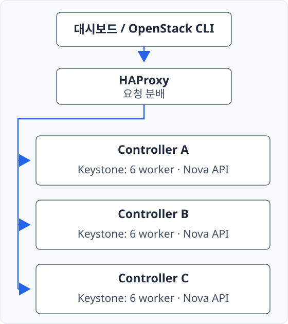
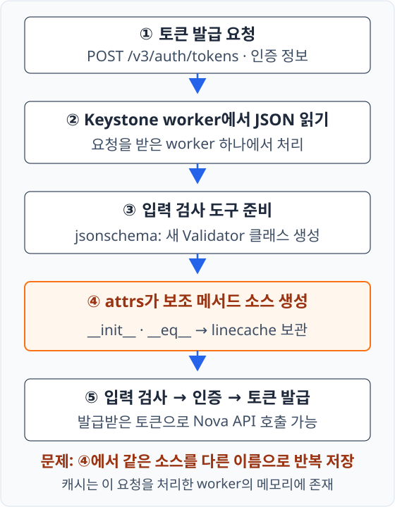

!!! abstract "문제와 해결을 한눈에"
    - **대시보드 조회가 느려진 상황.** 특정 Controller에서 인증 토큰 발급에 2초 이상, 하이퍼바이저 목록 조회에 6~7초 소요.
    - **요청 검사에 쓰이는 보조 Python 코드가 메모리에 중복 보관되는 문제.** 같은 코드인데도 매번 새 항목으로 저장되고, 다음 저장 위치를 찾는 작업도 점점 증가.
    - **기존 라이브러리에 필요한 수정만 반영.** 같은 코드는 이미 보관한 항목을 재사용하도록 attrs 코드를 수정.
    - **반복 시험으로 중복 보관이 멈추는지 확인.** 원본은 시험할 때마다 저장 항목이 늘었지만, 수정본은 처음 만든 항목만 유지. 주요 API의 정상 응답도 확인.

---

## 1. 환경과 요청 처리 구조

<div class="environment-section" markdown="1">

| 항목 | 운영 환경 |
| --- | --- |
| OS | RHEL 9.4 |
| OpenStack | Caracal |
| Python | 3.9 계열 |
| attrs 패키지 | `python3-attrs-20.3.0-7.el9.noarch` |
| Keystone worker | Controller마다 6개 |

<div class="environment-grid" markdown="1">

<div markdown="1">

**Controller 구성**

[{ .architecture-diagram }](../assets/openstack-attrs-linecache/controller-topology.svg)

</div>

<div markdown="1">

**토큰 발급 흐름**

[{ .architecture-diagram }](../assets/openstack-attrs-linecache/token-request-flow.svg)

</div>

</div>

<div class="section-body" markdown="1">

- **HAProxy:** 앞단에서 각 Controller로 API 요청 분배.
- **Keystone:** 사용자 인증과 토큰 발급. **Nova API:** 가상머신·하이퍼바이저 조회.
- **worker:** 요청 처리 프로세스. **PID:** 프로세스 식별 번호. 요청에 따라 CPU가 높은 worker가 달라져 6개 전체 관찰.
- **linecache:** 각 worker의 메모리에 생성 소스를 보관하는 Python 캐시. 외부 Memcached와는 별개.
- 목록 조회는 Keystone 인증 토큰을 받아 Nova API를 호출하는 흐름. 인증과 실제 조회 시간을 나눠 확인.

</div>

</div>

---

## 2. 증상과 영향

<div class="section-body" markdown="1">

사내 대시보드에는 **`/os-hypervisors/detail`을 주기적으로 호출하는 로직** 존재. 해당 조회가 느려져 분석 시작, `nova-api.log`에서도 약 10초의 처리시간 확인.

Controller별로 호출해 보니 **문제 노드에서만 토큰 발급과 목록 조회가 느린 상황**.

| 관찰 항목 | 정상 노드 A/B | 문제 노드 C |
| --- | --- | --- |
| Keystone 토큰 발급 | 약 0.3초 | **약 2.3~2.4초** |
| 하이퍼바이저 조회 CLI | 문제 노드보다 빠른 응답 | **약 6~7초** |
| Keystone `GET /v3` | 빠른 응답 | 빠른 응답 |
| 일부 API worker CPU | 대체로 낮음 | **약 100~200%** |
| worker RSS | 약 200,000 KiB | **약 1,700,000 KiB** |

RSS는 프로세스가 실제 물리 메모리에 보유한 메모리 크기. 문제 노드의 worker에서는 정상 노드보다 훨씬 큰 메모리 사용량 확인.

API 로그의 약 10초와 CLI의 6~7초는 서로 다른 호출의 관측값. CLI에는 인증과 클라이언트 처리도 포함될 수 있으므로 시간 차이를 그대로 한 구간의 비용으로 계산하지 않음.

</div>

---

## 3. 원인 분석

조회 API → 요청 분배 → 트래픽 → 외부 응답 대기 → Python 실행 순서로 범위를 축소. **각 단계에서 지연을 설명할 수 있는지 확인하고 다음 조사 대상 결정.**

<details class="analysis-toggle" markdown="1">
<summary>3-1. API 버전 때문에 추가 작업이 생긴 것은 아닐까?</summary>

**의심한 이유:** Nova는 API 버전에 따라 처리 내용이 달라질 수 있어, 특정 버전의 추가 작업이 지연을 만드는지 확인 필요.

**확인:** `2.87`과 `2.88` 비교. 테스트에서는 차이가 있었지만 운영 대시보드는 `2.87`을 사용했고, 운영 비교에서는 뚜렷한 차이를 찾지 못함.

**판단:** 2.88의 uptime 관련 추가 처리만으로 설명하기 어려워, 공통 인증·API 처리 경로로 조사 범위 이동.


</details>

<details class="analysis-toggle" markdown="1">
<summary>3-2. 로드밸런서를 우회해도 느릴까?</summary>

**의심한 이유:** API 앞단의 HAProxy에서 요청을 중계·분배하는 시간이 길어질 가능성.

**확인:** HAProxy를 거치지 않고 문제 노드의 Keystone `:5000`으로 직접 호출. 직접 호출에서도 토큰 발급에 약 2초 이상 소요.

**판단:** 로드밸런서만의 문제보다 문제 노드 내부의 처리 경로를 확인할 필요.

`GET /v3`는 API 버전·서비스 정보 확인에 쓰이는 가벼운 요청. 토큰 발급 POST는 인증 데이터를 받아 검사와 인증을 수행하므로, GET이 빠르다는 사실만으로 토큰 발급 경로까지 정상이라고 판단할 수 없음.


</details>

<details class="analysis-toggle" markdown="1">
<summary>3-3. 요청이 많아서 처리하지 못하는 상황일까?</summary>

**의심한 이유:** 문제 노드에 요청이 몰리면 worker가 바빠지고 뒤의 요청도 지연될 가능성.

**확인:** tcpdump로 Keystone 통신 비교. 노드 간 통신 규모는 대체로 유사했고, 설정·패키지·Fernet key도 유사. Fernet key는 토큰 암호화에 사용하는 키. 높은 CPU·메모리는 문제 노드에서만 관찰.

**판단:** 현재 요청량 차이만으로 설명하기 어려워 worker 내부 상태에 집중.

6개 PID 자체는 유지됐지만 CPU가 높은 worker는 기존 프로세스 사이에서 교대. 요청을 받은 worker가 비싼 작업을 수행하는 상황과 맞는 모습. 실제로 POST는 계속 유입되고 있었으므로 완전한 무요청 상태는 아님.


</details>

<details class="analysis-toggle" markdown="1">
<summary>3-4. DB나 캐시 응답을 기다리는 것은 아닐까?</summary>

**의심한 이유:** 토큰 발급에는 사용자·권한 조회가 있어 DB나 캐시 연결 대기도 후보. 같은 DB를 사용하더라도 노드별 통신 경로는 다를 수 있음. LDAP은 미사용.

**확인:** strace로 통신·대기 작업과 소요시간 확인. 관찰 범위에서 긴 DB·Memcached·socket 응답 대기는 찾지 못했고, CPU는 주로 `%usr`에서 증가.

**판단:** `%usr`는 프로그램 코드 실행에 사용한 CPU 비율. 외부 응답 대기보다 Python 안의 연산을 추적할 필요. 단, 이번 수집만으로 모든 I/O 문제를 배제한 것은 아님.


</details>

<details class="analysis-toggle" markdown="1">
<summary>3-5. Python 안에서는 어떤 작업이 반복될까?</summary>

**의심한 이유:** 높은 `%usr`와 짧은 통신 대기는 Python 내부의 반복 연산을 의심할 근거. strace로는 문자열 생성·캐시 검색 같은 프로그램 내부 연산 확인이 어려움.

**확인:** perf로 실행이 집중된 라이브러리 비교. 정상 노드는 비밀번호 해시 계산과 관련된 `_bcrypt.abi3.so`, **문제 노드는 Python 실행을 담당하는 libpython**이 두드러짐. 별도 bcrypt 시험에서 노드 간 뚜렷한 차이는 찾지 못함.

Python 함수 호출을 추적하는 USDT 이벤트로 범위를 더 좁혀 다음 위치 확인:

- `attr/_make.py`의 **`_generate_unique_filename()`** — 동적으로 만든 코드에 붙일 이름 생성.
- `uuid.py`의 **`__str__()`** — 이름 예약에 쓰는 식별 값을 문자열로 변환.
- `<attrs generated ... Validator-N>` — 검사 도구의 생성 소스에 붙은 가상 파일명.

문제 노드의 생성 파일명 번호는 약 **69만**, 정상 노드는 약 **2만** 수준. 여기서 `Validator-N`의 N은 생성 소스의 파일명 번호이며, 살아 있는 객체 개수나 캐시 항목을 직접 센 값은 아님. 메모리에서도 `RssAnon`·`Anonymous`·`Private_Dirty`·`VmData` 증가. 공유 라이브러리만 커진 것이 아니라 프로세스의 사유·익명 메모리가 늘어난 상황.

**판단:** 큰 번호의 생성 소스, 이름 생성 함수의 반복 실행, 프로세스 메모리 증가가 함께 관찰돼 코드 생성·보관 경로로 범위 축소.


</details>

!!! tip "원인 후보를 좁힌 핵심 근거"
    높은 CPU만으로 attrs 결함을 확정한 것은 아님. **실행 위치가 attrs의 이름 생성 경로에 집중**되고, **생성 소스 번호와 메모리 사용량도 크게 증가**한 점을 함께 확인. 이후 실제 소스 분석과 수정 전후 시험으로 중복 보관 동작 검증.

??? note "사용한 진단 명령 — 목적·옵션·결과 읽기"
    !!! warning "실행 전 확인"
        대상은 분석할 Controller. `P` 또는 `HOT_PID`에는 현재 확인한 worker PID 지정. strace와 perf는 처리 성능에 영향을 줄 수 있어 짧게 수집. 통신 로그에는 인증 정보가 포함될 수 있으므로 외부 공유 전 점검 필요.

    **통신량 비교: tcpdump**

    **왜 확인했는지:** 문제 노드에만 많은 요청이 들어오는지 확인. 처리 비용을 비교하기 전 트래픽 차이부터 점검.

    ```bash
    tcpdump -i any -nn -tttt 'tcp port 5000'
    ```

    - `-i any`: 모든 네트워크 인터페이스에서 수집.
    - `-nn`: IP·포트 번호를 이름으로 변환하지 않고 숫자로 표시.
    - `-tttt`: 패킷 시각을 날짜와 시간으로 표시.
    - `tcp port 5000`: 출발지 또는 목적지 TCP 포트가 5000인 패킷만 표시.

    **읽는 방법:** 노드별 통신 규모와 시각 비교. 패킷 수가 HTTP 요청 수와 정확히 같지는 않음.

    **worker의 CPU 확인: pidstat**

    **왜 확인했는지:** 같은 worker가 계속 CPU를 쓰는지, 처리 주체가 바뀌는지 확인. 어느 프로세스를 추적할지 결정하는 단계.

    ```bash
    pidstat -t -u -p "$P" 1
    ```

    - `-t`: 프로세스 내부 스레드까지 표시.
    - `-u`: CPU 사용 정보 표시.
    - `-p "$P"`: 지정한 PID만 관찰.
    - `1`: 1초 간격으로 출력.

    **읽는 방법:** 순간값 한 번보다 반복 출력의 `%usr`·`%system`·`%CPU` 변화 확인. `%system`은 커널 작업, `%usr`는 프로그램 코드 실행에 사용한 CPU.

    **통신 대기시간 확인: strace**

    **왜 확인했는지:** API가 느린 동안 DB·캐시 응답을 기다리는지 확인. CPU 연산이 느린 상황과 외부 응답 대기 구분.

    ```bash
    timeout -s INT 10 strace -f -ttT -yy -p "$P" \
      -e trace=%network,poll,ppoll,select,pselect6 \
      -o /tmp/keystone-network.strace
    ```

    - `timeout -s INT 10`: 10초 뒤 인터럽트 신호로 추적 종료.
    - `-p`: 지정한 프로세스에 추적 연결. `-f`: 스레드·자식 프로세스도 추적.
    - `-tt`: 호출 시각을 세밀하게 표시. `-T`: 개별 호출에 걸린 시간 표시.
    - `-yy`: 연결 등 파일 디스크립터의 상세 정보 표시.
    - `-e trace=…`: 통신과 대기 계열만 선택. `-o`: 결과를 파일로 저장.

    **읽는 방법:** 특정 연결의 호출에서 긴 시간이 반복되는지 확인. 긴 호출이 없다는 결과만으로 모든 I/O 문제를 배제하지 않음.

    **이벤트 대기 요약: epoll·accept**

    **왜 확인했는지:** 연결을 받거나 이벤트를 기다리는 호출에 시간이 몰리는지 보조 확인.

    ```bash
    timeout -s INT 10 strace -f -c \
      -e trace=epoll_wait,epoll_pwait,epoll_ctl,accept,accept4 \
      -p "$HOT_PID"
    ```

    `-c`는 개별 로그 대신 syscall 호출 수·시간·오류 수를 집계. `epoll_wait`는 이벤트 대기, `epoll_ctl`은 감시 대상 등록·변경, `accept`는 연결 수락 관련 호출.

    **읽는 방법:** 요약 비율은 선택한 syscall의 집계 시간 비중이며 프로세스 CPU 사용률이 아님. `epoll_wait`가 100%라는 이유만으로 반복 연산이나 timeout 확정 불가.

    perf의 라이브러리 분석은 실행 위치를 좁히는 과정, Python USDT는 함수 호출 경로 확인용. 함수 진입 이벤트 수가 CPU 사용시간은 아니며 임시 probe는 수집 후 제거.

---

## 4. 동일 소스가 누적되는 원리

<p class="subsection-title"><strong>4-1. 토큰 발급 요청에도 입력값 검사가 필요</strong></p>

<div class="section-body" markdown="1">

`openstack token issue`는 Keystone의 `POST /v3/auth/tokens` 호출을 통해 토큰 발급 요청. 인증 방식·사용자·프로젝트 등의 정보는 JSON 형식으로 전달.

Keystone은 **JSON을 읽은 뒤 입력 데이터의 구조가 맞는지 먼저 검사**, 이후 실제 사용자 인증과 토큰 발급 진행. 예를 들어 필요한 항목이 빠졌거나 자료형이 잘못된 요청을 걸러내는 단계.

이 검사 규칙이 **스키마(schema)**, 규칙에 따라 입력을 확인하는 도구가 **Validator**.

[Keystone Caracal의 토큰 발급 코드](https://github.com/openstack/keystone/blob/24.0.0/keystone/api/auth.py)에서 확인한 순서:

```python title="keystone/api/auth.py — 토큰 발급 처리 일부" hl_lines="2"
auth_data = self.request_body_json.get('auth')
auth_schema.validate_issue_token_auth(auth_data)
token = authentication.authenticate_for_token(auth_data)
```

!!! tip "코드에서 확인할 핵심"
    강조된 **두 번째 줄이 스키마 검증의 진입점**. 실제 사용자 인증 전에 실행되는 검사이며, 이 과정에서 검사 도구의 보조 코드 생성·보관 발생.

</div>

<p class="subsection-title"><strong>4-2. 검사 도구를 준비하면서 보조 코드 생성</strong></p>

<div class="section-body" markdown="1">

스키마 검증은 Keystone의 `SchemaValidator`를 거쳐 Python 라이브러리 **jsonschema**로 연결. jsonschema는 이 경로에서 `extend()` → `create()`를 호출해 새 Validator 클래스 생성.

클래스는 객체의 데이터와 기능을 정의한 설계도. 여기서는 검사 도구의 설계도를 요청 처리 중 새로 만드는 방식이라 **동적 클래스 생성**으로 표현.

새 클래스에는 초기화나 비교 같은 기본 기능도 필요. `@attr.s`는 **attrs라는 보조 라이브러리에 해당 코드 생성을 맡기는 표시**.

| 생성되는 코드 | 필요한 이유 |
| --- | --- |
| `__init__` | 검사 도구를 만들 때 사용할 스키마 등 초기값 설정 |
| `__eq__` | 객체 간 동등성 비교. attrs의 기본 생성 기능 |
| `__hash__` | 해시 기능을 사용하는 클래스에서 생성. 이번 수정 범위에도 포함 |

“입력값을 검사하는 일”에 앞서 “검사 도구를 준비하는 일”이 있고, **이번 병목은 준비 과정에서 만들어진 코드의 보관 방식**.

</div>

<p class="subsection-title"><strong>4-3. 왜 생성한 코드를 메모리에 보관할까?</strong></p>

<div class="section-body" markdown="1">

attrs는 메서드 소스를 문자열로 만든 다음 실행 가능한 Python 코드로 변환. 이 소스는 실제 파일에서 읽은 것이 아니므로, 오류나 디버깅 시 내용을 표시하려면 별도 보관이 필요.

Python의 **linecache**가 그 역할을 담당. `<attrs generated init ... Validator>` 같은 가상 파일명을 붙이고 생성 소스 저장. 실제 디스크 파일을 만드는 것이 아니라 **프로세스 메모리에 소스 문자열과 관련 정보를 보관**.

</div>

<p class="subsection-title"><strong>4-4. 문제는 보관 자체가 아니라 동일 소스의 중복 등록</strong></p>

<div class="section-body" markdown="1">

!!! warning "같은 내용을 다른 번호로 계속 저장"
    오류 분석을 위해 생성 소스를 linecache에 보관하는 기능은 정상적인 용도. **기존 구현은 이미 같은 소스가 있어도 재사용하지 않고 `Validator-2`, `Validator-3`처럼 다른 이름으로 반복 보관.** 이 중복과 이름 탐색 비용이 누적되는 것이 문제.

<figure class="flow">
  <ol>
    <li>검사 코드 생성</li>
    <li>빈 이름 탐색</li>
    <li>새 항목으로 보관</li>
  </ol>
  <ul>
    <li>기존 attrs 20.3.0의 소스 보관 순서. 코드 내용이 같아도 반복 등록.</li>
  </ul>
</figure>

기존 `_generate_unique_filename()`은 UUID라는 식별 값으로 이름을 예약하고, 이미 사용된 이름이면 `-2`·`-3` 등을 처음부터 탐색. **생성 소스가 같은지 비교해 재사용하는 처리 부재.**

그래서 두 가지 비용이 함께 증가:

1. **메모리 증가:** 같은 메서드 소스를 반복 보관.
2. **CPU 비용 증가:** 다음 코드를 등록할 때 앞의 이름들을 다시 탐색.

이미 많은 항목을 보유한 worker라면 요청이 적어도 한 번의 준비 작업에 큰 비용 발생. 현재 트래픽 규모가 비슷한데 문제 노드만 느린 현상과 연결되는 이유. 다만 문제 노드에 더 많이 누적된 정확한 과거 호출·가동 이력은 별도 확인 대상.

관련 소스: [Keystone 검증 연결](https://github.com/openstack/keystone/blob/24.0.0/keystone/auth/schema.py), [Keystone SchemaValidator](https://github.com/openstack/keystone/blob/24.0.0/keystone/common/validation/validators.py), [jsonschema 4.16.0 클래스 생성](https://github.com/python-jsonschema/jsonschema/blob/v4.16.0/jsonschema/validators.py), [attrs 20.3.0 이름 생성](https://github.com/python-attrs/attrs/blob/20.3.0/src/attr/_make.py#L1429-L1456).

</div>

---

## 5. 코드 수정

<div class="section-body" markdown="1">

이미 공개된 [attrs 수정 #828](https://github.com/python-attrs/attrs/commit/38580632ceac1cd6e477db71e1d190a4130beed4)을 기존 20.3.0 코드에 반영. **기존 버전을 유지하면서 필요한 수정만 가져오는 백포트** 방식.

수정 파일은 `/usr/lib/python3.9/site-packages/attr/_make.py`. 다른 최신 버전의 파일 전체를 그대로 교체한 것은 아님.

<figure class="flow">
  <ol>
    <li>검사 코드 생성</li>
    <li>이름·내용 비교</li>
    <li>같으면 기존 항목 사용</li>
  </ol>
  <ul>
    <li>수정 후 소스 보관 순서. 같은 이름이라도 코드 내용이 다르면 별도 항목 등록.</li>
  </ul>
</figure>

!!! tip "수정의 핵심 — 보관은 유지, 같은 소스는 재사용"
    **이름과 소스 내용이 같으면 기존 항목 재사용**, 내용이 다르면 별도 등록. 검사 클래스 생성이나 디버깅용 소스 보관 기능 자체를 없애는 수정은 아님.

[코드 변경 보기 — 빨간색 원본 / 초록색 수정본](https://github.com/wjdxotjd112/tech-notes/commit/93fe7d8ee88b13328e773f69ed50f991866f0542){ .button }

[원본 코드](https://github.com/wjdxotjd112/tech-notes/blob/4ebd34d/examples/attrs-linecache/attr/_make.py) · [수정 코드](https://github.com/wjdxotjd112/tech-notes/blob/93fe7d8ee88b13328e773f69ed50f991866f0542/examples/attrs-linecache/attr/_make.py) · [전체 diff 다운로드](../assets/openstack-attrs-linecache/python-attrs-20.3.0-7.el9-linecache-backport.patch)

GitHub 변경 커밋은 `_make.py` 한 파일만 수정. 좌우 비교를 선택하면 제거한 코드와 추가한 코드 확인 가능.

| 수정 위치 | 변경 목적 |
| --- | --- |
| `_generate_unique_filename()` | 기본 이름 생성만 담당하도록 변경 |
| `_make_method()` | 이름과 소스 내용 비교, 동일 항목 재사용 |
| `_make_init()`·`_make_eq()`·`_make_hash()` | 공통 생성·보관 경로 사용 |

</div>

---

## 6. 수정 전후 검증

<p class="subsection-title"><strong>6-1. 왜 API를 수십만 번 호출하지 않았는지</strong></p>

<div class="section-body" markdown="1">

HTTP 요청 전체에는 인증, DB, 네트워크, worker 분배 등 여러 요인 포함. 이번 수정이 겨냥한 부분은 **검사 도구 준비 시 같은 소스가 중복 보관되는지 여부**.

별도 Rocky Linux 9.6 테스트 노드에서 Keystone이 사용하는 `SchemaValidator`의 생성 경로만 분리해 10회 반복. 원본과 수정본이 같은 일을 수행할 때 코드 보관 항목이 계속 늘어나는지 비교.

10회는 **누적 방식이 바뀌었는지 확인하기 위한 횟수**, 운영 성능이나 장기 안정성을 모두 검증하기 위한 부하량은 아님.

</div>

<p class="subsection-title"><strong>6-2. 숫자 2개와 20개가 의미하는 것</strong></p>

<div class="section-body" markdown="1">

이 시험에서는 검사 도구를 한 번 준비할 때 `__init__`와 `__eq__`의 소스가 한 항목씩 생성돼 최초 **2개** 등록.

| 같은 검사 도구를 준비한 횟수 | 원본의 관련 소스 보관 항목 | 수정본의 관련 소스 보관 항목 |
| --- | --- | --- |
| 1회 | 2개 | 2개 |
| 2회 | 4개 | 2개 |
| 5회 | 10개 | 2개 |
| 10회 | **20개** | **2개** |

!!! tip "검증 결과 읽기"
    **원본은 같은 소스를 계속 추가, 수정본은 최초 2개를 재사용.** 처음 준비할 때의 기능은 유지하면서, 같은 검사 도구를 다시 준비할 때 중복 항목이 늘지 않는지 확인한 결과.

각 조건은 별도의 Python 시험 프로세스에서 측정했고, 실제 설치한 수정본에서도 같은 결과 확인.

전체 linecache 크기나 운영 worker의 캐시를 직접 센 결과가 아니라, 이 시험의 Validator 관련 소스 항목 수.

추가 기능 확인도 진행:

- 객체 초기화·비교·해시, 다른 생성 소스의 분리, 동시 생성, Keystone 스키마 검증 정상.
- Keystone 토큰 발급·Nova 하이퍼바이저 조회·Cinder 서비스 조회 성공.

API 정상 응답 확인까지 진행했지만, 운영 환경의 패치 전후 응답시간이나 전체 OpenStack 회귀 시험을 대신하는 결과는 아님.

??? note "수동 수정과 검증 명령"
    !!! warning "적용 대상과 복구 준비"
        검증한 패키지는 `python3-attrs-20.3.0-7.el9.noarch`. 다른 버전이나 이미 수정된 코드에는 그대로 적용하지 않고 차이 확인. 원본 소스·기존 bytecode 백업과 관련 서비스의 원복 계획 준비.

    **패키지와 원본 상태 확인**

    **목적:** 수정할 파일이 검증한 버전인지, 다른 변경이 이미 있는지 확인.

    ```bash
    rpm -q python3-attrs
    rpm -V python3-attrs
    ```

    `-q`는 설치 버전 조회, `-V`는 RPM에 기록된 파일 상태와 실제 파일 비교. 수정 전 차이가 있으면 먼저 확인.

    이후 원본 `_make.py`와 기존 `.pyc`를 백업하고 GitHub 변경 커밋에 맞춰 소스 수동 수정. `.pyc`는 Python이 생성하는 실행용 bytecode이므로 직접 편집하지 않음.

    **Python 문법 확인**

    **목적:** 수동 편집 과정의 들여쓰기·문법 오류를 서비스 반영 전에 확인.

    ```bash
    python3 -m py_compile /usr/lib/python3.9/site-packages/attr/_make.py
    ```

    `-m py_compile`은 Python의 문법 검사·bytecode 생성 모듈 실행. 서비스와 같은 Python 3.9 사용. 문법 통과가 기능 검증까지 뜻하지는 않음.

    **같은 검사 도구 10회 준비**

    **목적:** 최초 준비 이후에도 동일 코드의 보관 항목이 계속 늘어나는지 확인.

    ```bash
    python3 - <<'PY'
    import linecache
    from keystone.common.validation.validators import SchemaValidator

    marker = "jsonschema.validators.create.<locals>.Validator"
    for key in list(linecache.cache):
        if marker in key:
            del linecache.cache[key]

    counts = []
    for _ in range(10):
        SchemaValidator({"type": "object"})
        counts.append(sum(marker in key for key in linecache.cache))

    print("linecache_counts=" + ",".join(map(str, counts)))
    PY
    ```

    `marker`는 해당 검사 도구의 소스 이름만 골라 세기 위한 문자열. 간단한 객체 형식의 스키마를 반복 사용해 조건 고정.

    **수정본의 확인 기준:** `2,2,2,2,2,2,2,2,2,2`처럼 최초 등록 이후 항목 수 유지. 이 명령은 새 시험 프로세스만 사용하며 실행 중인 Keystone worker의 캐시를 지우지 않음.

</div>

---

## 7. 운영 반영과 재발 방지

<div class="section-body" markdown="1">

**worker 재기동만으로도 누적된 메모리가 초기화돼 일시적으로 빨라질 수 있음.** 하지만 원본 코드가 남아 있으면 같은 조건에서 다시 누적 가능. 재기동은 임시 완화, 백포트는 누적 방식 수정.

수정 파일을 저장해도 이미 실행 중인 worker는 이전에 읽은 코드 사용. 새 코드를 반영하려면 관련 서비스의 계획된 재기동 필요.

!!! warning "운영 반영 전"
    실제 서비스 구동 방식을 확인한 뒤 HAProxy에서 대상 노드의 요청을 빼고 순차 작업. 해당 환경의 대상은 Keystone을 구동하는 httpd와 Nova·Cinder API 등. 원본 복원·재기동 절차와 주요 API 확인 준비. 테스트에서도 종료 지연과 일시적 서비스 실패 이력이 있어 재기동 영향 점검 필요.

수동 변경은 RPM 재설치·업데이트로 덮어써질 수 있어, 장기 운영에는 **수정 이력을 관리하는 백포트 RPM 또는 배포사 공식 패키지** 검토.

운영 반영 후에는 같은 API의 응답시간과 worker CPU·RSS를 확인하고, 시간이 지나도 다시 증가하지 않는지 관찰. **재기동 직후가 아니라 반복 요청 이후의 상태까지 확인**하는 것이 재발 방지의 핵심.

</div>

---

## 8. 관련 사례와 참고 자료

<div class="section-body" markdown="1">

- [attrs Issue #826](https://github.com/python-attrs/attrs/issues/826): 같은 이름의 클래스를 반복 생성할수록 처리 비용이 커진 문제.
- [attrs 수정 #828](https://github.com/python-attrs/attrs/commit/38580632ceac1cd6e477db71e1d190a4130beed4): 동일 생성 소스의 보관 항목 재사용.
- [Launchpad #2121607](https://bugs.launchpad.net/nova/+bug/2121607): Caracal 이후 Nova API 응답시간·메모리 증가를 조사해 python-attrs로 원인 연결.
- [Ubuntu Jammy 수정 패키지](https://bugs.launchpad.net/nova/+bug/2121607/comments/18): 기존 21.2.0에 수정사항을 백포트한 `21.2.0-1ubuntu1`. [2025년 12월 9일 업데이트 배포 완료](https://bugs.launchpad.net/nova/+bug/2121607/comments/17).
- [strace 옵션 설명](https://man7.org/linux/man-pages/man1/strace.1.html) · [pidstat 옵션 설명](https://man7.org/linux/man-pages/man1/pidstat.1.html).
- [백포트 코드의 attrs MIT 라이선스](../assets/openstack-attrs-linecache/UPSTREAM_LICENSE.txt).

</div>
